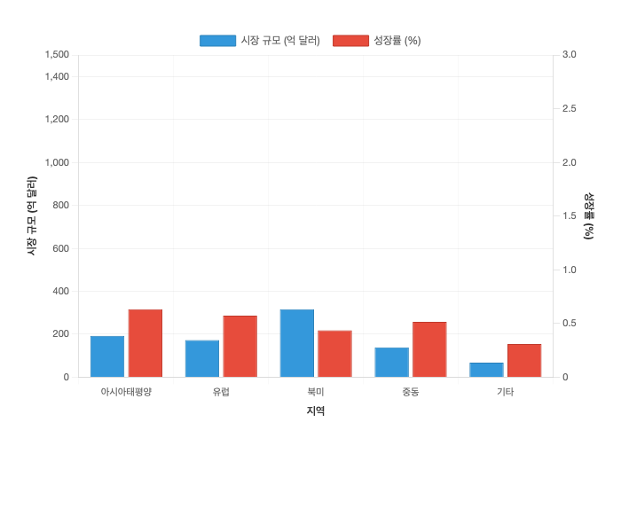

# MD to DOCX 변환기 사용법 가이드

한국어 서식을 지원하는 Markdown에서 Word 문서로의 변환 도구입니다.

## 🚀 빠른 시작 (Windows)

### 1단계: 초기 설정
1. 이 폴더의 모든 파일을 Windows 컴퓨터에 복사하세요
2. `setup.bat` 파일을 **관리자 권한으로** 실행하세요
   - 파일을 우클릭 → "관리자 권한으로 실행" 선택
3. 설치가 완료될 때까지 기다리세요

### 2단계: 문서 변환

#### 방법 1: GUI 사용 (추천 ⭐)
1. `start_gui.bat` 파일을 더블클릭으로 실행하세요
2. GUI에서 "찾아보기" 버튼으로 `.md` 파일을 선택하세요
3. 출력 폴더와 파일명을 설정하세요
4. "변환 시작" 버튼을 클릭하세요

#### 방법 2: 명령줄 사용
1. 변환하고 싶은 `.md` 파일을 이 폴더에 넣으세요
2. `convert.bat` 파일을 더블클릭으로 실행하세요
3. 변환된 `.docx` 파일이 생성됩니다!

## 📋 필수 요구사항

- **Windows 10 이상**
- **Python 3.7 이상** ([다운로드](https://www.python.org/downloads/))
- **Google Chrome 브라우저** ([다운로드](https://www.google.com/chrome/))

## 🎯 주요 기능

### ✅ 지원하는 기능
- **한국어 폰트**: 맑은 고딕, 나눔고딕 자동 적용
- **자동 차트 생성**: HTML 차트를 PNG 이미지로 변환
- **Word 캡션**: 그림/표에 자동 번호 매김
- **표 서식**: 전문적인 표 디자인
- **제목 스타일**: 계층적 제목 구조
- **이미지 삽입**: PNG, JPG, GIF 지원

### 📊 차트 기능
- 시장 성장 추세 차트 (선 그래프)
- 지역별 성장 전망 (막대 차트)
- 예산 분배도 (원 차트)
- 예산 추세 (선 그래프)

## 📁 폴더 구조
```
make-docs/
├── setup.bat              # 초기 설정 스크립트 (Windows)
├── start_gui.bat           # GUI 실행 스크립트 (Windows) ⭐
├── start_gui.sh            # GUI 실행 스크립트 (macOS/Linux)
├── convert.bat             # 명령줄 변환 스크립트 (Windows)
├── gui_converter.py        # GUI 애플리케이션
├── md_to_docx_converter.py # 메인 변환 프로그램
├── images/                 # 차트 HTML 및 생성된 이미지
│   ├── market_growth_line.html
│   ├── market_growth_regional.html
│   ├── budget_pie.html
│   └── budget_trend.html
├── venv/                   # Python 가상환경 (설정 후 생성)
└── README.md              # 이 파일
```

## 🔧 문제 해결

### Python을 찾을 수 없다는 오류
1. [Python 공식 사이트](https://www.python.org/downloads/)에서 Python 설치
2. 설치 시 "Add Python to PATH" 옵션 체크
3. 컴퓨터 재시작 후 다시 실행

### Chrome을 찾을 수 없다는 오류
1. [Google Chrome](https://www.google.com/chrome/) 설치
2. `convert.bat` 파일을 메모장으로 열어서 Chrome 경로 수정:
   ```batch
   set "CHROME_PATH=C:\Program Files\Google\Chrome\Application\chrome.exe"
   ```

### 한글이 깨지는 경우
- Windows에서 CMD 창이 UTF-8을 지원하지 않을 수 있습니다
- convert.bat 실행 시 자동으로 처리되지만, 여전히 문제가 있다면 PowerShell 사용을 권장합니다

### 차트가 생성되지 않는 경우
1. Chrome이 정상 설치되어 있는지 확인
2. `images` 폴더에 `.html` 파일이 있는지 확인
3. 안티바이러스 소프트웨어가 Chrome 실행을 차단하지 않는지 확인

## 📝 사용 예시

### Markdown 파일 예시
```markdown
# 사업 계획서

## 시장 분석


<표 1> 시장 현황

| 연도 | 매출 | 성장률 |
|------|------|--------|
| 2023 | 100억 | 5% |
| 2024 | 120억 | 20% |

<그림 1> 지역별 분석


```

### 변환 결과
- Word 문서에서 자동으로 "표 1", "그림 1" 캡션 생성
- 한글 폰트로 깔끔한 서식 적용
- 차트 이미지 자동 삽입

## 🆘 지원

문제가 발생하거나 도움이 필요한 경우:
1. `setup.bat`을 관리자 권한으로 다시 실행
2. Python과 Chrome이 최신 버전인지 확인
3. Windows 업데이트 확인

---
**팁**: 첫 실행 시에는 인터넷 연결이 필요합니다 (패키지 다운로드)

## 📚 개발자 정보 (고급 사용법)

### macOS/Linux 사용법

#### GUI 사용 (추천)
```bash
# GUI 실행
./start_gui.sh
```

#### 명령줄 사용
```bash
# 가상환경 설정
python3 -m venv venv
source venv/bin/activate
pip install -r requirements.txt

# 문서 변환
python md_to_docx_converter.py input.md [output.docx]
```

## 지원하는 마크다운 요소

- 제목 (# Title)
- 헤딩 (## Heading, ### Sub-heading)
- 단락
- 리스트 (순서 있는/없는 목록)
- 테이블
- 페이지 구분 (### Page N 형식)
- 굵은 글씨, 기울임꼴

## 문서 스타일 특징

### 표지 페이지
- **대제목**: 24pt, 굵게, 가운데 정렬, 검은색
- **부제목**: 18pt, 가운데 정렬, 검은색
- **정보**: 14pt, 가운데 정렬 (날짜, 조직명)

### 내용 페이지
- **문서 제목**: 20pt, 굵게, 가운데 정렬, 파란색 계열
- **헤딩1**: 16pt, 굵게, 파란색 계열, 섹션 번호 포함
- **헤딩2**: 14pt, 굵게, 파란색 계열, 들여쓰기 적용
- **헤딩3**: 12pt, 굵게, 파란색 계열, 들여쓰기 적용
- **본문**: 11pt, 줄간격 1.3, 양쪽 정렬, 첫 줄 들여쓰기
- **목차**: 전용 스타일로 계층형 구조 표현

### 테이블
- **헤더**: 굵게, 가운데 정렬, 회색 배경
- **내용**: 왼쪽 정렬, 격자 테두리
- **폰트**: 10pt 맑은 고딕

### 페이지 설정
- **여백**: 상단 1.2인치, 하단 1인치, 좌우 1.2인치
- **폰트**: 전체 맑은 고딕 적용

## 최적화된 차트 생성 기능

### 자동 최적화 차트 (2024년 업데이트)
- **완벽한 캡처**: 세로/가로 짤림 없는 정확한 사이즈
- **최소 여백**: 불필요한 공백 제거로 깔끔한 결과
- **자동 사이즈 선택**: 차트 유형별 최적 캡처 사이즈 자동 적용
- **표준화된 설정**: 일관된 고품질 결과 보장

### 개별 차트 (캡션 매칭 완벽) ✨
| 파일명 | 캡션 매칭 | 사이즈 |
|--------|-----------|--------|
| `market_growth_line.png` | `<그림 3> 방산 수출 성장 추이` | 700×500 |
| `market_growth_regional.png` | `<그림 4> 지역별 성장 전망` | 700×500 |
| `budget_pie.png` | `<그림 5> 분야별 투자 배분` | 700×500 |
| `budget_trend.png` | `<그림 6> 연도별 투자 추이` | 700×500 |

### 전체 차트 유형
| 차트 유형 | 자동 적용 사이즈 | 특징 |
|-----------|------------------|------|
| 시스템 구성도 | 1100×750 | 계층구조 완전 표시 |
| 시장 성장 차트 (통합) | 1200×650 | 차트 2개 완벽 배치 |
| 예산 배분 (통합) | 1200×650 | 차트 2개 완벽 배치 |
| SWOT 분석 | 1000×750 | 매트릭스+전략 완전 표시 |
| TRL 로드맵 | 1200×900 | 매트릭스 형태 완전 표시 |
| 조직도 | 1000×700 | 모든 계층 완전 표시 |
| 리스크 매트릭스 | 800×750 | 매트릭스+범례 완전 표시 |

## 파일 구조

```
├── md_to_docx_converter.py       # 메인 변환 스크립트  
├── create_html_charts.py         # 최적화된 차트 생성기 (기본)
├── create_additional_html_charts.py # 최적화된 차트 생성기 (추가)
├── convert.sh                    # 간편 실행 스크립트
├── requirements.txt              # 의존성 패키지 목록
├── venv/                        # 가상환경 (생성됨)
├── data/                        # 입력 파일들 (마크다운, 참고 문서)
├── images/                      # 생성된 차트 파일들 (HTML, PNG)
├── template/                    # 템플릿 및 가이드 문서
│   ├── 최적화된_차트_생성_템플릿.py
│   ├── 차트_캡처_최적화_가이드.md
│   ├── AI_어시스턴트_지침서.md
│   └── 사용가이드.md
└── output/                      # 변환된 DOCX 파일들이 저장되는 폴더
```

## 문제 해결

- **Python 버전**: Python 3.7 이상 필요
- **가상환경**: 패키지 충돌 방지를 위해 가상환경 사용 권장
- **한글 폰트**: 시스템에 맑은 고딕 폰트가 설치되어 있어야 함