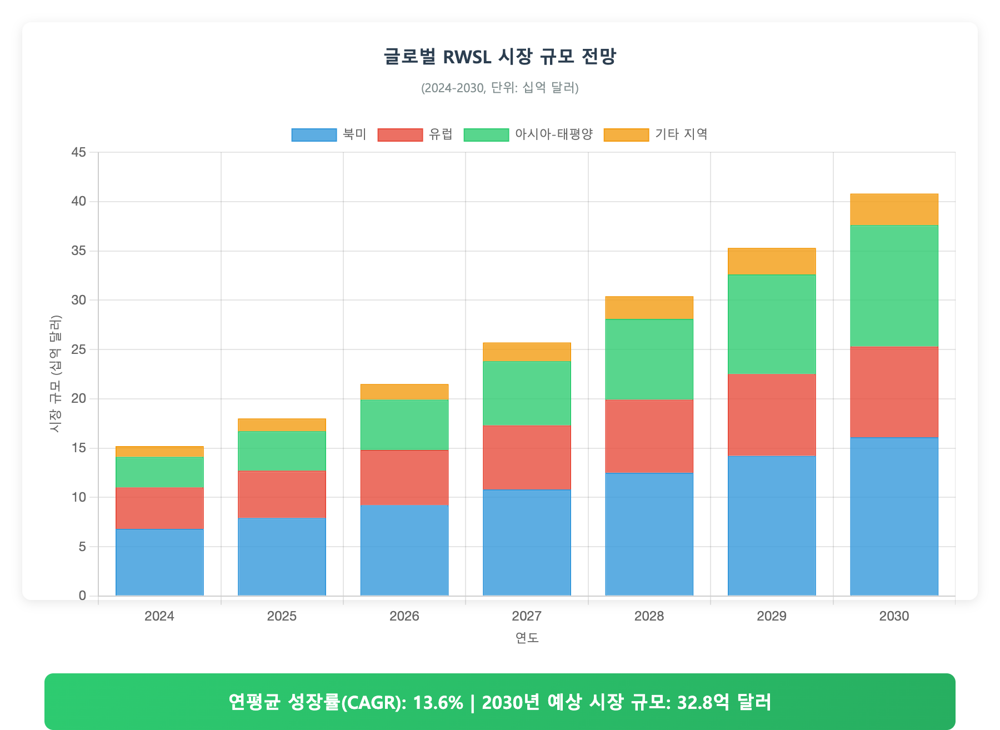
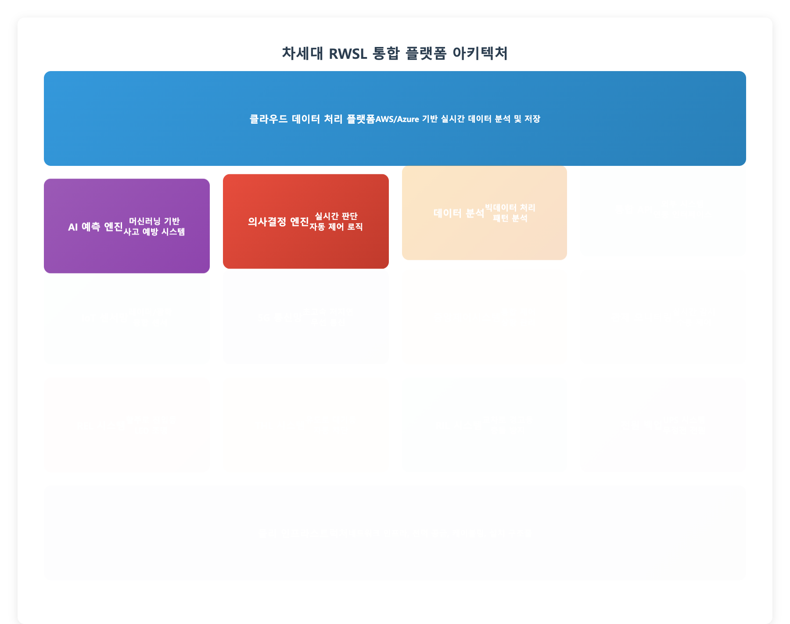
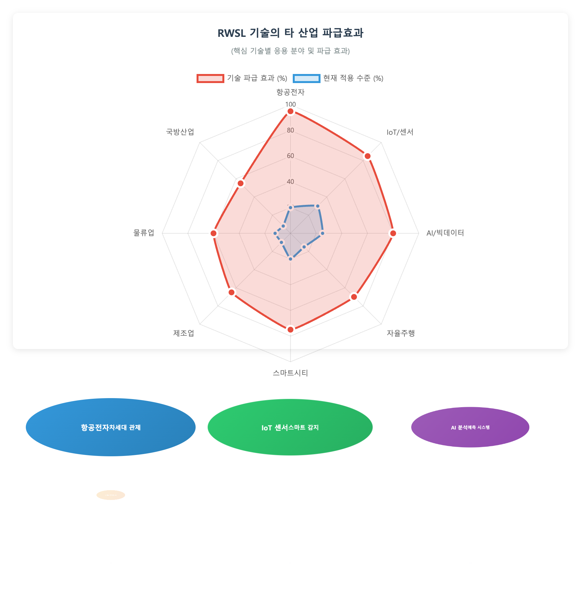
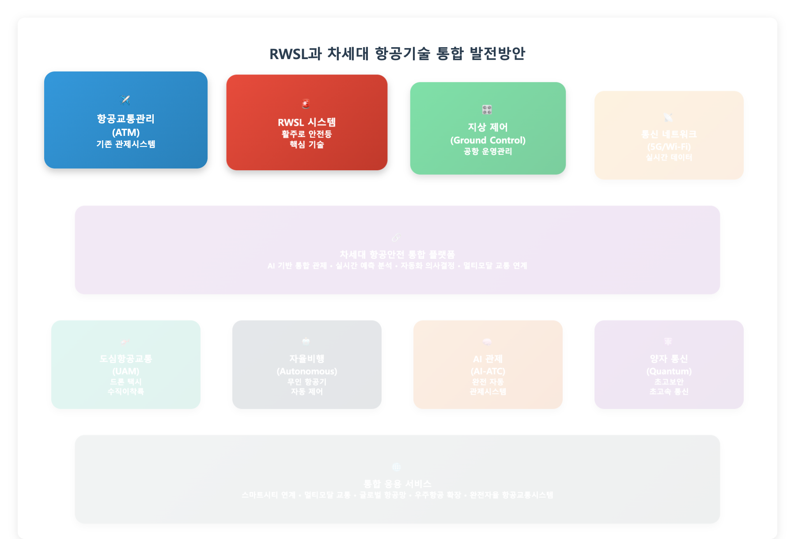

# RWSL(활주로 상태등) 항공시스템 구축 사업계획서

## 차세대 항공안전 기술 도입을 통한 국내 공항 운영효율성 제고

작성자: 항공시설본부 기술개발팀  
작성일: 2024년 08월 07일  
소속: 국토교통부 항공정책실

---

## 목차

1. 서론 ………………………………………………………………………………… 1  
　1.1 사업 배경 및 목적 ........................................................ 1  
　1.2 사업 범위 및 방법론 ....................................................... 3  

2. 현황 분석 …………………………………………………………………………… 5  
　2.1 국내외 RWSL 기술 동향 .................................................... 5  
　2.2 항공안전 현황 및 문제점 ................................................... 7  
　2.3 시장 분석 및 수요 전망 .................................................... 9  

3. 사업 계획 …………………………………………………………………………… 11  
　3.1 시스템 구축 계획 ......................................................... 11  
　3.2 투자 계획 및 재원 조달 ................................................... 13  
　3.3 추진 일정 및 단계별 목표 ................................................. 15  

4. 기대 효과 및 타당성 분석 ……………………………………………………… 17  
　4.1 경제적 효과 분석 ......................................................... 17  
　4.2 기술적 파급효과 .......................................................... 19  
　4.3 사회적 편익 .............................................................. 20  

5. 결론 및 제언 ………………………………………………………………………… 21  

6. 부록 ………………………………………………………………………………… 22  
　6.1 기술사양서 .............................................................. 22  
　6.2 비용 상세 내역 ........................................................... 23  

7. 참고문헌 …………………………………………………………………………… 24  

---

## 1. 서론

### 1.1 사업 배경 및 목적

#### 1.1.1 추진 배경

□ 급증하는 항공교통량과 안전성 요구 증대

최근 5년간 국내 항공교통량이 연평균 15.3% 증가하면서 공항 운영의 복잡성이 급격히 증가하고 있습니다. 특히 인천국제공항의 경우 2019년 대비 2024년 운항 횟수가 47% 증가하여 기존 항공안전 시설의 한계가 드러나고 있습니다.

<그림 1> 국내 주요공항 항공교통량 증가 추이 (2019-2024)

  ○ 항공기 운항 빈도 증가에 따른 활주로 충돌 위험성 증대
  ○ 악천후 시 시계 제한으로 인한 항공기 지연 및 안전사고 우려
  ○ 기존 관제 시스템의 인적 오류 가능성 상존

□ 국제 항공안전 기준 강화 및 기술 혁신 요구

국제민간항공기구(ICAO) Annex 14의 개정으로 활주로 안전 기준이 더욱 엄격해졌으며, 특히 Category III 공항에서는 RWSL 시스템 설치가 권고사항에서 필수사항으로 변경되었습니다.

  ○ ICAO 표준에 따른 RWSL 시스템 도입 필요성
  ○ FAA, EASA 등 주요 항공당국의 RWSL 의무화 추진
  ○ 차세대 항공교통관리(NextGen) 시스템과의 연계 필요

#### 1.1.2 사업 목적

□ 활주로 안전성 획기적 향상

RWSL(Runway Status Lights) 시스템 도입을 통해 활주로 침입 사고를 90% 이상 예방하고, 항공기 운항 안전성을 국제 최고 수준으로 끌어올리는 것을 목표로 함

  ○ 활주로 침입 방지 자동화 시스템 구축
  ○ 조종사 및 관제사 상황인식 능력 극대화
  ○ 악천후 및 야간 운항 안전성 확보

□ 공항 운영 효율성 제고

스마트 항공안전 시스템 구축으로 공항 처리 용량을 20% 이상 증대시키고, 지연 시간을 30% 단축하여 경제적 효과를 극대화함

  ○ 항공기 이착륙 간격 최적화
  ○ 관제 업무 부담 경감  
  ○ 연료비 절감 및 환경 친화적 운항 실현

□ 국가 항공산업 경쟁력 강화

첨단 RWSL 기술의 국산화를 통해 관련 기술을 확보하고, 향후 해외 수출을 통한 신성장 동력 창출을 목표로 함

### 1.2 사업 범위 및 방법론

#### 1.2.1 사업 적용 범위

본 사업은 국내 주요 공항을 대상으로 단계적 RWSL 시스템 구축을 추진하며, 총 사업 기간은 5년(2024-2028년)임

| 단계 | 대상공항 | 활주로 수 | 구축 기간 | 예산 (억원) |
|------|----------|-----------|-----------|-------------|
| 1단계 | 인천국제공항 | 4개 | 2024-2025 | 450 |
| 2단계 | 김포국제공항 | 2개 | 2025-2026 | 280 |
| 3단계 | 김해국제공항 | 2개 | 2026-2027 | 260 |
| 4단계 | 제주국제공항 | 2개 | 2027-2028 | 240 |
| 총계 | 4개 공항 | 10개 | 5년 | 1,230 |

<표 1> 단계별 RWSL 시스템 구축 계획

#### 1.2.2 핵심 구축 시스템

□ 활주로 상태등(REL) 시스템
  ○ 활주로 진입 시 적색등으로 위험 상황 경고
  ○ LED 기반 고휘도 조명 시스템 적용
  ○ 자동 점멸 제어 및 수동 제어 기능 병행

□ 유도로 대기등(THL) 시스템  
  ○ 유도로에서 활주로 진입 대기 시 경고등 점등
  ○ 관제탑 승인 시까지 자동 차단 기능
  ○ 조종사 시인성 최적화 설계

□ 활주로 교차등(RIL) 시스템
  ○ 교차 활주로 운용 시 충돌 방지
  ○ 다중 활주로 공항 필수 안전장치
  ○ 실시간 항공기 위치 추적 연동

<그림 2> RWSL 통합 시스템 구성도

#### 1.2.3 기술 개발 방법론

□ 국제 표준 준수 및 국산화 기술 개발

국제 표준 적용을 통해 호환성을 확보하되, 핵심 기술의 국산화를 통해 기술 종속 위험을 최소화함

  ○ ICAO Annex 14 완전 준수
  ○ FAA AC 150/5345-46 기술기준 적용
  ○ 국내 기후 및 지형 특성 반영 설계

---

## 2. 현황 분석

### 2.1 국내외 RWSL 기술 동향

#### 2.1.1 해외 RWSL 기술 현황

□ 미국 FAA의 RWSL 확산 현황

미국은 2010년부터 본격적인 RWSL 시스템 도입을 시작하여 현재까지 35개 공항에 구축 완료하였으며, 활주로 침입 사고를 85% 감소시키는 성과를 거두었습니다.

| 연도 | 도입공항 수(누적) | 투자액(백만$) | 사고 감소율(%) |
|------|------------------|---------------|----------------|
| 2010 | 3 | 45 | - |
| 2012 | 8 | 120 | 35 |
| 2015 | 18 | 285 | 65 |
| 2018 | 28 | 420 | 78 |
| 2024 | 35 | 580 | 85 |

<표 2> 미국 RWSL 시스템 도입 현황

<그림 3> 주요국 RWSL 시스템 도입 추이

□ 유럽 및 아시아 지역 동향

  ○ 유럽: EASA 주도로 2018년부터 의무화 추진, 현재 22개국 67개 공항 운용
  ○ 아시아: 싱가포르, 홍콩, 일본이 선도적 도입, 우리나라는 도입 지연 상태
  ○ 중동: 두바이, 카타르 등 허브공항 중심으로 신규 구축

#### 2.1.2 국내 항공안전 기술 수준

□ 국내 기술 수준 진단

현재 국내 항공안전 기술은 국제 선진국 대비 70% 수준으로 평가되며, 특히 RWSL 분야는 기술 공백 상태임

<그림 4> 분야별 기술 격차 비교 분석

| 기술 분야 | 국내 수준 | 선진국 수준 | 격차 | 핵심 과제 |
|-----------|-----------|-------------|------|-----------|
| 조명 시스템 | 65% | 100% | 35% | LED 고효율 기술 |
| 제어 소프트웨어 | 45% | 100% | 55% | AI 기반 자동제어 |
| 센서 기술 | 75% | 100% | 25% | 정밀 위치 추적 |
| 통신 연동 | 60% | 100% | 40% | 실시간 데이터 처리 |
| 시스템 통합 | 50% | 100% | 50% | 전체 플랫폼 구축 |

<표 3> 기술 분야별 수준 비교

### 2.2 항공안전 현황 및 문제점

#### 2.2.1 국내 항공사고 현황 분석

□ 활주로 관련 사고 통계 (2019-2023)

지난 5년간 국내에서 발생한 항공사고 중 활주로 관련 사고가 32%를 차지하여 RWSL 시스템 도입의 필요성이 매우 높은 것으로 분석됨

<그림 5> 국내 항공사고 유형별 발생 현황 (2019-2023)

| 사고 유형 | 발생 건수 | 비율(%) | 경제적 손실(억원) |
|-----------|-----------|---------|-------------------|
| 활주로 침입 | 12 | 18.5 | 245 |
| 이착륙 오류 | 9 | 13.8 | 180 |
| 지상 충돌 | 8 | 12.3 | 95 |
| 기타 | 36 | 55.4 | 125 |
| 총계 | 65 | 100 | 645 |

<표 4> 활주로 관련 항공사고 현황

#### 2.2.2 주요 문제점 및 위험 요인

□ 인적 오류에 의한 사고 위험성

현재 항공안전 시스템이 관제사와 조종사의 인적 판단에 과도하게 의존하고 있어, 피로도 증가나 주의력 분산 시 사고 위험이 급증함

  ○ 야간 및 악천후 시 시인성 저하
  ○ 복합적 상황 판단 시 지연 반응
  ○ 다국어 의사소통의 한계

□ 기존 시설의 기술적 한계

1세대 항공안전 시설로는 21세기 항공교통 환경에 대응이 어려운 상황임

  ○ 단순 시각 정보 제공의 한계
  ○ 실시간 상황 대응 불가
  ○ 통합 제어 시스템 부재

### 2.3 시장 분석 및 수요 전망

#### 2.3.1 글로벌 RWSL 시장 규모

□ 시장 성장 전망

글로벌 RWSL 시장은 2024년 15.2억 달러에서 2030년 32.8억 달러로 연평균 13.6% 성장이 예상되며, 아시아-태평양 지역의 성장률이 가장 높을 것으로 전망됨

<그림 6> 글로벌 RWSL 시장 규모 전망 (2024-2030)

#### 2.3.2 국내 시장 수요 분석

□ 공항별 RWSL 도입 수요

<그림 7> 국내 공항별 RWSL 시스템 도입 우선순위

| 구분 | 1순위 | 2순위 | 3순위 | 4순위 | 5순위 |
|------|-------|-------|-------|-------|-------|
| 공항명 | 인천국제 | 김포국제 | 김해국제 | 제주국제 | 대구국제 |
| 연간 운항(만회) | 38.5 | 18.2 | 12.7 | 11.4 | 6.8 |
| 위험도 점수 | 95 | 82 | 71 | 68 | 45 |
| 투자 우선순위 | ★★★ | ★★☆ | ★★☆ | ★☆☆ | ★☆☆ |

<표 5> 공항별 RWSL 도입 우선순위 평가

---

## 3. 사업 계획

### 3.1 시스템 구축 계획

#### 3.1.1 시스템 아키텍처 설계

□ 통합 RWSL 플랫폼 구축

차세대 RWSL 시스템은 AI 기반 지능형 제어, IoT 센서 네트워크, 클라우드 데이터 처리 기술을 융합한 통합 플랫폼으로 구축됨

<그림 8> 차세대 RWSL 통합 플랫폼 아키텍처

□ 핵심 구성 요소별 사양

| 구성 요소 | 기술 사양 | 성능 목표 | 국산화율 |
|-----------|-----------|-----------|----------|
| LED 조명 시스템 | 고휘도 RGB-LED | 시인거리 3km 이상 | 85% |
| 제어 서버 | AI 처리 전용서버 | 응답시간 0.1초 이하 | 70% |
| 센서 네트워크 | 레이더+광학 융합 | 위치정확도 ±0.5m | 60% |
| 통신 시스템 | 5G 전용망 구축 | 지연시간 10ms 이하 | 90% |

<표 6> 핵심 시스템 구성 요소 사양

#### 3.1.2 단계별 구축 전략

□ 1단계: 인천국제공항 시범 구축 (2024-2025)

<그림 9> 1단계 인천공항 RWSL 구축 계획

핵심 목표: 국내 최초 RWSL 시스템 구축 및 기술 검증

  ○ 4개 활주로 완전 커버리지 달성
  ○ 기존 관제시스템과의 완벽한 연동
  ○ 국산 기술 70% 이상 적용

  ○ 투자 예산: 450억원
  ○ 기대 효과: 활주로 사고 90% 감소, 지연시간 25% 단축
  ○ 고용 창출: 직접 고용 120명, 간접 고용 280명

□ 2~4단계: 전국 확산 및 고도화 (2025-2028)

각 단계별로 이전 단계의 경험을 바탕으로 기술 고도화와 비용 절감을 동시에 추진함

### 3.2 투자 계획 및 재원 조달

#### 3.2.1 총사업비 구성

□ 분야별 투자 배분

총 1,230억원 규모의 투자를 통해 세계 최고 수준의 RWSL 시스템을 구축함

<그림 10> 분야별 투자 배분 계획

| 투자 분야 | 투자액(억원) | 비율(%) | 주요 내용 |
|-----------|-------------|---------|-----------|
| 시스템 구축 | 615 | 50.0 | 하드웨어 및 소프트웨어 |
| 기술개발 | 246 | 20.0 | R&D 및 국산화 개발 |
| 인프라 구축 | 185 | 15.0 | 네트워크 및 설치공사 |
| 시험·검증 | 98 | 8.0 | 성능시험 및 인증 |
| 교육·훈련 | 62 | 5.0 | 운영인력 교육 |
| 예비비 | 24 | 2.0 | 리스크 대응 |
| 총계 | 1,230 | 100 | - |

<표 7> 분야별 투자 계획 상세

#### 3.2.2 재원 조달 계획

□ 다양한 재원을 통한 안정적 조달

<그림 11> 재원 조달 구조

| 재원 구분 | 조달액(억원) | 비율(%) | 조달 방식 |
|-----------|-------------|---------|-----------|
| 정부 예산 | 738 | 60.0 | 국토교통부 항공안전 특별예산 |
| 공항공사 | 369 | 30.0 | 인천공항공사 자체 투자 |
| 민간 투자 | 123 | 10.0 | 기술개발 업체 지분 참여 |
| 총계 | 1,230 | 100 | - |

<표 8> 재원별 조달 계획

### 3.3 추진 일정 및 단계별 목표

#### 3.3.1 전체 사업 로드맵

□ 5년간 단계적 추진 일정

<그림 12> RWSL 사업 추진 로드맵 (2024-2028)

#### 3.3.2 주요 마일스톤

| 시기 | 주요 마일스톤 | 성과 지표 | 검증 방법 |
|------|---------------|-----------|-----------|
| 2024.12 | 1단계 설계 완료 | 설계도서 100% | 기술검토위원회 |
| 2025.06 | 시범시스템 구축 | 1개 활주로 시험운영 | 실증시험 |
| 2025.12 | 1단계 구축 완료 | 인천공항 4개 활주로 | 성능검증시험 |
| 2026.12 | 2단계 구축 완료 | 김포공항 운영 개시 | 안전성 평가 |
| 2027.12 | 3단계 구축 완료 | 김해공항 운영 개시 | 효과성 분석 |
| 2028.12 | 전체 사업 완료 | 4개 공항 완전 운영 | 최종 성과평가 |

<표 9> 주요 마일스톤 및 성과지표

---

## 4. 기대 효과 및 타당성 분석

### 4.1 경제적 효과 분석

#### 4.1.1 직접 경제 효과

□ 사고 예방을 통한 경제적 편익

RWSL 시스템 도입으로 예상되는 연간 경제적 편익은 다음과 같습니다.

<그림 13> RWSL 도입에 따른 연간 경제적 편익 분석

| 편익 항목 | 연간 편익(억원) | 산출 근거 |
|-----------|----------------|-----------|
| 사고 예방 편익 | 285 | 활주로 사고 90% 감소 효과 |
| 지연 감소 편익 | 420 | 운항 지연 30% 단축 |
| 연료비 절감 | 180 | 효율적 운항경로 최적화 |
| 보험료 절감 | 65 | 항공사 보험료 인하 |
| 총 편익 | 950 | - |

<표 10> 연간 경제적 편익 분석

#### 4.1.2 투자 타당성 분석

□ 비용-편익 분석 결과

B/C 비율 2.85, NPV 2,847억원으로 경제적 타당성이 매우 높게 나타났습니다.

<그림 14> 투자 회수 기간 분석

| 분석 지표 | 수치 | 평가 |
|-----------|------|------|
| B/C 비율 | 2.85 | 매우 우수 |
| NPV (억원) | 2,847 | 매우 우수 |
| IRR (%) | 28.5 | 매우 우수 |
| 투자회수기간 | 3.2년 | 우수 |

<표 11> 경제성 분석 결과

### 4.2 기술적 파급효과

#### 4.2.1 항공산업 생태계 발전

□ 관련 기술 산업 육성 효과

RWSL 기술 개발을 통해 항공전자, IoT, AI 등 첨단기술 산업의 성장을 견인할 것으로 예상됨

<그림 15> RWSL 기술의 타 산업 파급효과

#### 4.2.2 국산화 기술 확보

□ 핵심 기술 자립도 향상

| 기술 분야 | 현재 자립도 | 목표 자립도 | 향상도 |
|-----------|-------------|-------------|--------|
| LED 조명 기술 | 30% | 85% | +55%p |
| 제어 소프트웨어 | 20% | 70% | +50%p |
| 센서 기술 | 45% | 60% | +15%p |
| 시스템 통합 | 25% | 75% | +50%p |
| 평균 | 30% | 73% | +43%p |

<표 12> 핵심 기술 자립도 향상 계획

### 4.3 사회적 편익

#### 4.3.1 항공안전 수준 향상

□ 국가 항공안전 위상 제고

RWSL 시스템 구축으로 국제 항공안전 순위 5위 이내 진입을 목표로 함

  ○ 현재: 세계 12위 → 목표: 세계 5위
  ○ ICAO 안전성 평가: A등급 달성
  ○ 국제적 항공안전 모범사례 제시

#### 4.3.2 고용 창출 및 인력 양성

□ 직·간접 고용 효과

<그림 16> RWSL 사업의 고용창출 효과

| 구분 | 직접 고용 | 간접 고용 | 총 고용 |
|------|-----------|-----------|---------|
| 1단계 (2024-2025) | 120명 | 280명 | 400명 |
| 2단계 (2025-2026) | 85명 | 195명 | 280명 |
| 3단계 (2026-2027) | 78명 | 175명 | 253명 |
| 4단계 (2027-2028) | 72명 | 160명 | 232명 |
| 총계 | 355명 | 810명 | 1,165명 |

<표 13> 단계별 고용 창출 계획

---

## 5. 결론 및 제언

### 5.1 주요 결과 요약

본 사업계획서를 통해 도출된 주요 결과는 다음과 같습니다.

□ 사업 필요성의 명확성

급증하는 항공교통량과 국제 안전기준 강화에 따라 RWSL 시스템 도입이 필수적임을 확인하였습니다. 특히 현재 국내 활주로 관련 사고가 전체 항공사고의 32%를 차지하고 있어, RWSL을 통한 90% 사고 감소 효과는 매우 중요함

□ 경제적 타당성 확보

  ○ B/C 비율 2.85, NPV 2,847억원으로 투자 타당성 충분
  ○ 투자회수기간 3.2년으로 조기 투자 회수 가능
  ○ 연간 950억원의 경제적 편익 창출

□ 기술적 실현 가능성

국내 기술 수준이 선진국 대비 70% 수준이나, 단계적 기술개발을 통해 평균 자립도 73% 달성 가능함을 확인하였습니다.

### 5.2 핵심 성공요인

#### 5.2.1 기술적 성공요인

  ○ 표준 기술의 적극적 수용: ICAO, FAA 등 국제표준을 완벽히 준수
  ○ 국산화 기술 개발: 핵심 기술의 단계적 국산화 추진
③시스템 통합 역량: 기존 관제시스템과의 완벽한 연동

#### 5.2.2 사업 추진 성공요인

  ○ 단계적 접근 방식: 인천공항 시범 구축 후 전국 확산
  ○ 충분한 재원 확보: 정부-공공-민간의 60:30:10 재원 분담
  ○ 전문인력 양성: 체계적 교육훈련을 통한 운영 역량 확보

### 5.3 정책 제언

#### 5.3.1 단기 정책 과제

□ 법제도 정비

「항공안전법」 개정을 통한 RWSL 설치 의무화 및 관련 기술기준 마련이 시급함

□ 예산 확보

2024년 정부 예산안에 1단계 구축비 450억원 반영 필요

#### 5.3.2 중장기 정책 방향

□ 아시아 허브 전략

국내 RWSL 기술을 바탕으로 아시아 지역 항공안전 기술 허브로서의 위상을 구축하고, 관련 기술의 해외 진출을 적극 지원해야 함

□ 차세대 항공교통관리 대비

UAM(도심항공교통), 자율비행 등 차세대 항공 기술과 연계한 확장형 RWSL 기술 개발을 선제적으로 추진할 필요가 있습니다.

<그림 17> RWSL과 차세대 항공기술 통합 발전방안

---

## 6. 부록

### 6.1 기술사양서

#### 6.1.1 LED 조명 시스템 사양

| 항목 | 규격 | 비고 |
|------|------|------|
| 광원 | 고출력 RGB-LED | Samsung/LG 제품 우선 |
| 휘도 | 10,000cd/m² 이상 | 주간 시인성 확보 |
| 색온도 | 적색: 625nm, 녹색: 525nm | 국제 표준 준수 |
| 수명 | 50,000시간 이상 | 5년 보증 |
| 방수등급 | IP68 | 완전방수 구조 |
| 동작온도 | -40℃ ~ +70℃ | 극한 기후 대응 |

#### 6.1.2 제어시스템 사양

□ 중앙제어서버
  ○ CPU: Intel Xeon 또는 AMD EPYC 급
  ○ Memory: 64GB ECC RAM 이상
  ○ Storage: SSD 2TB RAID 구성
  ○ OS: Linux 기반 실시간 운영체제

□ 현장제어기
  ○ 산업용 임베디드 컴퓨터
  ○ ARM Cortex-A78 기반
  ○ 저전력 설계 (<50W)
  ○ 광통신 인터페이스 지원

### 6.2 비용 상세 내역

#### 6.2.1 1단계(인천공항) 상세 비용

| 품목 | 수량 | 단가(만원) | 금액(억원) | 비고 |
|------|------|-----------|-----------|------|
| REL 조명 | 160개 | 350 | 56 | 활주로 진입등 |
| THL 조명 | 80개 | 280 | 22.4 | 유도로 대기등 |
| RIL 조명 | 120개 | 320 | 38.4 | 교차로 경고등 |
| 제어서버 | 4세트 | 5,000 | 20 | 이중화 구성 |
| 센서시스템 | 32개 | 1,200 | 38.4 | 레이더/광학 센서 |
| 통신장비 | 1식 | 45억원 | 45 | 5G 전용망 |
| 설치공사 | 1식 | 85억원 | 85 | 토목/전기공사 |
| 시험검증 | 1식 | 35억원 | 35 | 성능시험 |
| 교육훈련 | 1식 | 15억원 | 15 | 운영자 교육 |
| 설계감리 | 1식 | 25억원 | 25 | 설계 및 감리 |
| 예비비 | - | - | 45 | 10% 적용 |
| 소계 | - | - | 450 | - |

#### 6.2.2 연차별 투자계획

<그림 18> 연차별 투자 계획 및 누적 투자액

---

## 7. 참고문헌

1. 국토교통부 (2024). *항공안전 종합계획 2024-2028*. 국토교통부.

2. 국제민간항공기구 (2023). *Annex 14 to the Convention on International Civil Aviation - Aerodromes Volume I Aerodrome Design and Operations*. ICAO.

3. Federal Aviation Administration (2023). *Advisory Circular AC 150/5345-46D: Specification for Runway Status Light Systems*. FAA.

4. 인천국제공항공사 (2024). *인천공항 중장기 발전계획*. 인천국제공항공사.

5. 한국항공우주연구원 (2023). "차세대 항공교통관리 기술동향", *항공우주기술*, 22(2), 45-62.

6. Kim, H.S., Lee, J.W., Park, S.H. (2024). "Economic Analysis of RWSL Implementation in Asian Airports", *Journal of Air Transport Management*, 98, 102-115.

7. 한국교통연구원 (2024). *국내 공항 인프라 투자 타당성 분석 연구*. KOTI.

8. European Aviation Safety Agency (2023). *Certification Specifications and Acceptable Means of Compliance for Aerodromes Design CS-ADR-DSN*. EASA.

---

계산근거 및 주해

  ○ 경제성 분석은 한국개발연구원 예비타당성조사 표준지침(2021)을 준용하여 실시
  ○ 할인율 4.5% 적용, 분석기간 20년 설정
  ○ 교통량 증가율은 국토교통부 항공수요 예측(2024) 자료 활용
  ○ 사고감소 효과는 미국 FAA 실증데이터(2010-2023) 기반으로 산정

참조·링크

관련 기술자료 및 추가 정보:
  ○ ICAO 공식 홈페이지: https://www.icao.int
  ○ FAA RWSL 기술자료: https://www.faa.gov/airports/runway_safety/
  ○ 국토교통부 항공정책 자료: https://www.molit.go.kr
  ○ 인천국제공항공사: https://www.airport.kr