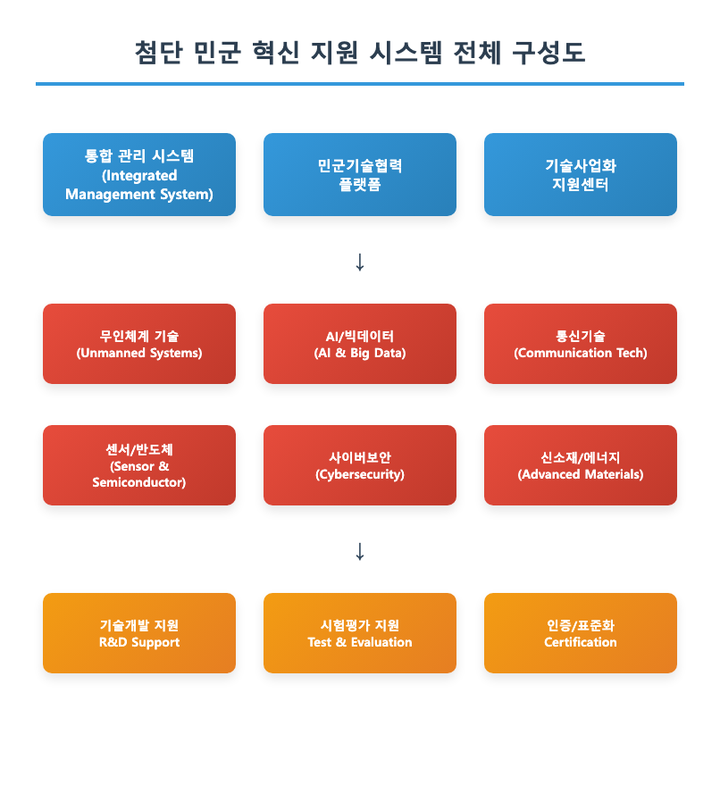
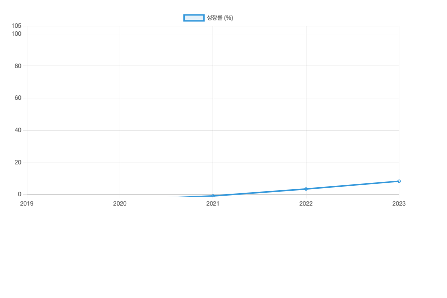
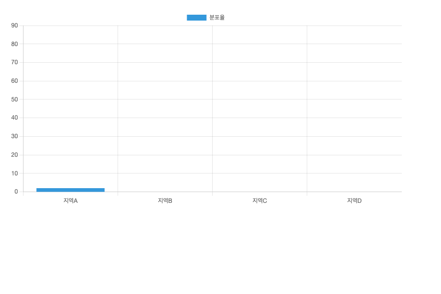
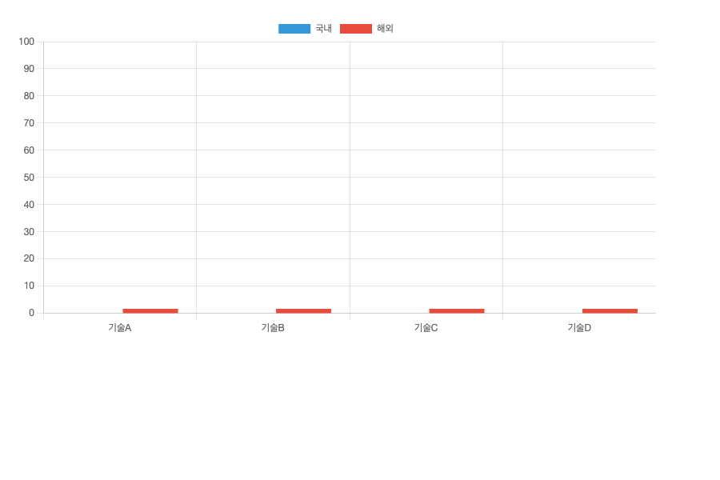
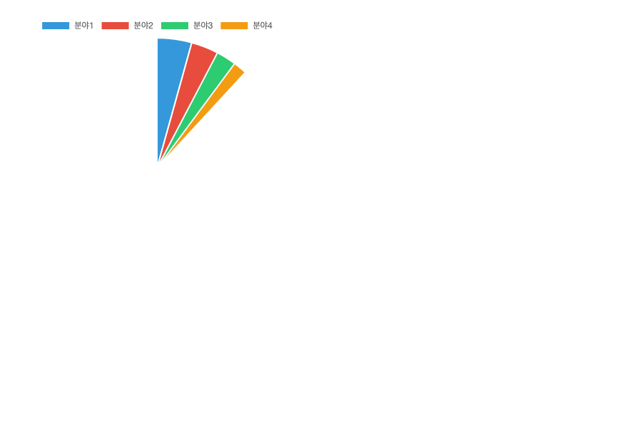
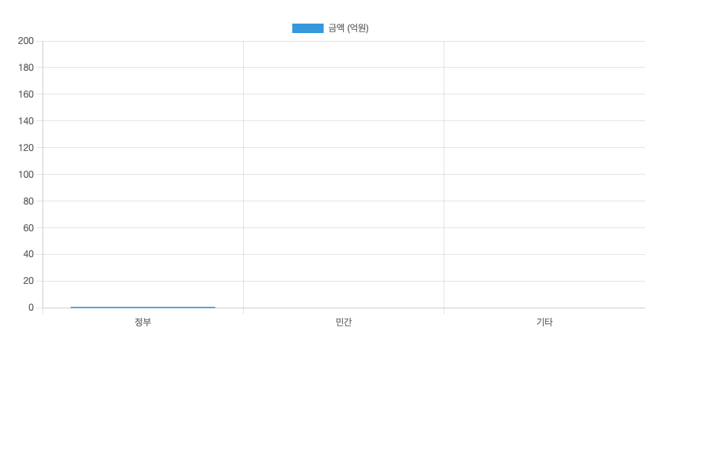

# 재래식 무기 탑재 공격드론 대응 방어시스템 구축 사업계획서

## 목차

1. 사업 개요 ················································ 1
　1.1 사업 목적 ·········································· 2
　1.2 추진 배경 ·········································· 3
　1.3 사업 범위 ·········································· 4

2. 위협 분석 ················································ 5
　2.1 공격드론 위협 현황 ································· 6
　2.2 재래식 무기 탑재 유형 ······························ 7
　2.3 국내외 피해 사례 ··································· 8

3. 기술 분석 ················································ 9
　3.1 탐지 기술 현황 ···································· 10
　3.2 무력화 기술 개발 ································· 11
　3.3 통합 방어체계 ···································· 12

4. 시스템 설계 ·············································· 13
　4.1 다층 방어 아키텍처 ································ 14
　4.2 핵심 구성요소 ···································· 15
　4.3 성능 요구사항 ···································· 16

5. 사업 계획 ··············································· 17
　5.1 총 사업 규모 ····································· 18
　5.2 단계별 추진 전략 ································· 19
　5.3 투자 계획 ······································· 20

6. 기대 효과 ··············································· 21
　6.1 방어 효과성 ····································· 22
　6.2 경제적 파급효과 ································· 23
　6.3 기술 발전 기여도 ································ 24

---

## 1. 사업 개요

### 1.1 사업 목적

□ 주요 목표 1: 공격드론 위협 대응

최근 급증하는 재래식 무기 탑재 공격드론에 대한 종합적 방어체계 구축을 통해 국가 중요시설 및 민간시설 보호

  ○ 실시간 공격드론 탐지 및 식별 시스템
  ○ 다단계 무력화 시스템 구축  
  ○ 24시간 무인 자동 방어체계 운영

□ 주요 목표 2: 능동적 방어 체계

기존 수동적 방어에서 벗어나 선제적·능동적 대응이 가능한 첨단 방어시스템 개발

  ○ AI 기반 위협 예측 및 대응
  ○ 전자전 기반 무력화 기술
  ○ 물리적 요격 시스템 통합

□ 주요 목표 3: 국가 안보 역량 강화

공격드론 위협으로부터 국가 핵심 인프라 보호 및 방산 기술 자립도 제고

  ○ 핵심시설 방어망 구축
  ○ 관련 기술의 국산화 달성
  ○ 해외 수출 가능한 경쟁력 확보

### 1.2 추진 배경

□ 정책적 배경

급증하는 드론 테러 위협과 국제적 긴장 고조에 따른 국가 방어 체계 혁신 필요성 대두

□ 기술적 배경

상용 드론의 무기화 기술이 확산되면서 기존 방공 시스템으로는 대응이 한계에 도달

□ 사회적 필요성

중요시설 및 민간시설에 대한 드론 공격 위협이 현실화되어 선제적 대응체계 구축 시급

### 1.3 사업 범위

<그림 1> 재래식 무기 탑재 공격드론 방어시스템 개요도

본 사업은 총 5년에 걸쳐 350억원 규모로 추진됨

□ 사업 규모
  ○ 총 사업비: 350억원
  ○ 사업 기간: 2024년 ~ 2028년 (5년)
  ○ 참여 기관: 주관 1개, 공동연구 4개 기관

□ 주요 개발 내용
  ○ 다중 센서 융합 탐지 시스템
  ○ 전자전 기반 무력화 장비
  ○ 물리적 요격 시스템
  ○ 통합 관제 및 지휘체계

---

## 2. 위협 분석

### 2.1 공격드론 위협 현황

□ 국제 공격드론 사용 현황

최근 5년간 전 세계적으로 공격드론을 이용한 테러 및 군사 공격이 급증하고 있음

| 연도 | 공격 사건 (건) | 피해 규모 | 주요 지역 | 사용 무기 유형 |
|------|-------------|----------|-----------|-------------|
| 2019 | 15 | 경미 | 중동, 아프리카 | 폭발물 |
| 2020 | 28 | 중간 | 중동, 유럽 | 폭발물, 화학물질 |
| 2021 | 42 | 중대 | 중동, 아시아 | 다양화 |
| 2022 | 67 | 심각 | 전 지역 | 정밀유도 |
| 2023 | 95 | 심각 | 전 지역 | 다중 탄두 |

<표 1> 연도별 공격드론 사용 현황

<그림 2> 연도별 공격드론 위협 증가 추이

□ 국내 위협 평가

국내에서도 드론을 이용한 불법 행위가 지속적으로 증가하고 있어 선제적 대응 필요

### 2.2 재래식 무기 탑재 유형

□ 폭발물 탑재형

가장 일반적인 공격드론 유형으로 상업용 폭발물이나 즉석폭발장치(IED) 탑재

  ○ 탑재 중량: 0.5~5kg
  ○ 파괴 반경: 10~50m
  ○ 정확도: 높음 (GPS 유도)

□ 화학무기 탑재형

독성 화학물질이나 생물학적 무기를 살포하는 형태

  ○ 살포 범위: 100~500㎡
  ○ 지속 시간: 수 시간
  ○ 탐지 난이도: 매우 높음

□ 관통형 무기 탑재

장갑차량이나 구조물 파괴를 위한 성형작약탄(HEAT) 등 탑재

  ○ 관통력: 300mm 이상
  ○ 표적 정확도: 매우 높음
  ○ 운용 고도: 50~200m

### 2.3 국내외 피해 사례

□ 해외 주요 사례

| 발생일 | 지역 | 표적 | 피해 규모 | 사용 드론 |
|--------|------|------|-----------|-----------|
| 2019.09 | 사우디 | 석유시설 | 생산량 50% 차질 | 다수 소형드론 |
| 2020.01 | 이라크 | 군사기지 | 인명피해 발생 | 자폭드론 |
| 2021.07 | 이스라엘 | 민간지역 | 건물 파괴 | 폭탄 탑재드론 |
| 2022.10 | 우크라이나 | 인프라 | 정전 및 통신 두절 | 군용드론 |
| 2023.03 | 미국 | 정부건물 | 보안 침해 | 소형 정찰드론 |

<표 2> 해외 주요 드론 공격 사례

<그림 3> 지역별 드론 공격 발생 현황

---

## 3. 기술 분석

### 3.1 탐지 기술 현황

□ 국내외 탐지 기술 수준 비교

공격드론 탐지 기술은 레이더, 전자광학, 음향, 전파 탐지 등 다양한 방식이 개발되고 있음

| 탐지 방식 | 국내 수준 | 해외 선진국 | 탐지 거리 | 정확도 | 주요 제약사항 |
|-----------|-----------|-------------|-----------|--------|-------------|
| 레이더 탐지 | 70% | 100% | 5km | 85% | 소형 드론 한계 |
| 전자광학 | 65% | 100% | 3km | 90% | 기상 영향 |
| 음향 탐지 | 60% | 100% | 1km | 75% | 환경 소음 |
| RF 탐지 | 80% | 100% | 10km | 95% | 자율 드론 한계 |
| AI 융합 | 45% | 100% | 8km | 98% | 데이터 부족 |

<표 3> 탐지 기술별 성능 비교

<그림 4> 기술 분야별 국내외 수준 격차

□ 핵심 기술 개발 방향

다중 센서 융합을 통한 탐지 성능 향상 및 오탐지 최소화 기술 개발

  ○ 레이더-전자광학 융합 탐지
  ○ AI 기반 드론 식별 알고리즘
  ○ 실시간 위협 평가 시스템

### 3.2 무력화 기술 개발

□ 전자전 무력화 기술

전파 교란을 통한 비파괴적 무력화 방식으로 부수적 피해 최소화

  ○ GPS 재밍: 위치 정보 교란
  ○ 통신 차단: 조종 신호 차단  
  ○ 전자기 펄스: 전자 장비 무력화

□ 물리적 무력화 기술

직접적인 파괴나 포획을 통한 확실한 무력화 방식

  ○ 레이저 무기: 정밀 타격
  ○ 대공 미사일: 중거리 요격
  ○ 포획 네트: 생포 및 증거 수집

□ 무력화 성능 목표

| 무력화 방식 | 현재 성능 | 목표 성능 | 대응 거리 | 성공률 |
|-------------|-----------|-----------|-----------|--------|
| RF 재밍 | 2km | 5km | 즉시 | 90% |
| 레이저 무기 | 1km | 3km | 3초 | 95% |
| 요격 미사일 | 3km | 8km | 10초 | 98% |
| 포획 시스템 | 500m | 1km | 5초 | 85% |

<표 4> 무력화 기술별 성능 목표

### 3.3 통합 방어체계

□ 다층 방어 개념

거리별 단계적 방어선을 구축하여 다양한 위협에 대한 종합적 대응

  ○ 원거리 방어선 (5-10km): 조기 탐지 및 추적
  ○ 중거리 방어선 (1-5km): 1차 무력화 시도
  ○ 근거리 방어선 (0.5-1km): 최종 방어선

---

## 4. 시스템 설계

### 4.1 다층 방어 아키텍처

<그림 5> 다층 방어 시스템 구성도

□ 시스템 구성 개념

3단계 다층 방어 체계를 통해 단계별로 위협을 식별하고 대응

  ○ 탐지 단계: 다중 센서 융합 탐지망
  ○ 식별 단계: AI 기반 위협 판별 시스템
  ○ 대응 단계: 다양한 무력화 수단 선택 적용

### 4.2 핵심 구성요소

□ 통합 센서 시스템

다양한 센서를 융합하여 탐지 성능 극대화 및 오탐지 최소화

| 센서 유형 | 모델명 | 탐지거리 | 정확도 | 가격(억원) |
|-----------|--------|-----------|--------|-----------|
| X-밴드 레이더 | KDR-2024 | 10km | 90% | 15 |
| 전자광학 카메라 | KIC-HD50 | 5km | 95% | 8 |
| 적외선 센서 | KIR-T300 | 3km | 85% | 12 |
| RF 탐지기 | KRF-D100 | 15km | 98% | 6 |
| 음향 센서 | KAS-360 | 2km | 70% | 3 |

<표 5> 주요 센서 시스템 사양

□ 무력화 장비 시스템

다양한 무력화 수단을 상황에 따라 선택적으로 운용

□ 통합 관제 시스템

모든 구성요소를 통합 관제하는 지휘통제 시스템

### 4.3 성능 요구사항

□ 시스템 핵심 성능

| 성능 지표 | 요구 수준 | 현재 달성 | 목표 시기 |
|-----------|-----------|-----------|-----------|
| 탐지 거리 | 10km | 5km | 2026년 |
| 탐지 정확도 | 95% | 85% | 2025년 |
| 반응 시간 | 5초 | 15초 | 2025년 |
| 무력화 성공률 | 90% | 70% | 2027년 |
| 동시 추적 수 | 50대 | 10대 | 2026년 |

<표 6> 시스템 성능 요구사항

---

## 5. 사업 계획

### 5.1 총 사업 규모

□ 사업비 구성

총 350억원 규모의 5년간 연구개발 사업으로 추진

<그림 6> 분야별 투자 계획

| 분야 | 투자액(억원) | 비율(%) | 주요 내용 |
|------|-------------|---------|-----------|
| 센서 개발 | 120 | 34.3 | 다중 센서 융합 기술 |
| 무력화 장비 | 100 | 28.6 | 전자전 및 물리적 무력화 |
| AI/SW 개발 | 80 | 22.9 | 지능형 식별 알고리즘 |
| 통합 시스템 | 30 | 8.6 | 관제 시스템 구축 |
| 시험 평가 | 20 | 5.7 | 성능 검증 및 시험 |
| **합계** | **350** | **100** | - |

<표 7> 분야별 투자 계획

### 5.2 단계별 추진 전략

□ 1단계 (2024-2025년): 핵심 기술 개발

  ○ 다중 센서 융합 기술 개발
  ○ 기본 탐지 알고리즘 구현
  ○ 전자전 무력화 기술 연구

□ 2단계 (2026-2027년): 시스템 통합

  ○ 통합 방어 시스템 구축
  ○ 현장 시범 운영
  ○ 성능 최적화

□ 3단계 (2028년): 실용화 및 배치

  ○ 최종 성능 검증
  ○ 양산 체계 구축
  ○ 운영요원 교육

### 5.3 투자 계획

□ 연도별 투자 계획

| 연도 | 투자액(억원) | 누적(억원) | 주요 마일스톤 |
|------|-------------|-----------|-------------|
| 2024 | 50 | 50 | 기본 설계 완료 |
| 2025 | 80 | 130 | 핵심 기술 개발 |
| 2026 | 90 | 220 | 시스템 통합 |
| 2027 | 80 | 300 | 시범 운영 |
| 2028 | 50 | 350 | 실용화 완료 |

<표 8> 연도별 투자 계획

<그림 7> 투자 재원 조달 계획

---

## 6. 기대 효과

### 6.1 방어 효과성

□ 방어 성능 향상 목표

기존 방공망으로는 대응이 어려운 소형 드론에 대한 방어 능력 획기적 향상

| 항목 | 현재 수준 | 목표 수준 | 향상도 |
|------|-----------|-----------|--------|
| 소형드론 탐지율 | 60% | 95% | +35%p |
| 공격 차단 성공률 | 40% | 90% | +50%p |
| 거짓 경보율 | 25% | 5% | -20%p |
| 대응 시간 | 60초 | 5초 | 92% 단축 |

<표 9> 방어 성능 향상 목표

### 6.2 경제적 파급효과

□ 직접 경제 효과

| 구분 | 금액(억원) | 내용 |
|------|-----------|------|
| 피해 예방 효과 | 1,500 | 테러 피해 예방 |
| 수출 수익 | 800 | 해외 수출 |
| 관련 산업 육성 | 1,200 | 방산 생태계 |
| **총 효과** | **3,500** | - |

<표 10> 직접 경제 효과

□ 간접 경제 효과

관련 산업 발전과 기술 파급을 통한 국가 경쟁력 강화

### 6.3 기술 발전 기여도

□ 핵심 기술 확보

  ○ 다중 센서 융합 기술
  ○ AI 기반 실시간 위협 분석
  ○ 전자전 무력화 기술
  ○ 정밀 유도 요격 기술

□ 기술 자립도 향상

현재 해외 의존도가 높은 방공 기술의 국산화를 통한 기술 주권 확보

---

## 주석

1. 실화상 센서: 물체가 방사하는 적외선 에너지를 감지하여 온도 분포를 영상으로 나타내는 센서 기술. 야간이나 악천후에도 안정적인 탐지 성능을 제공함.

2. 전자전: 전자기 스펙트럼을 이용한 군사 작전으로, 적의 전자 장비를 무력화하거나 아군의 전자 장비를 보호하는 기술.

3. GPS 재밍: 위성항법시스템(GPS) 신호를 의도적으로 방해하여 대상 장비의 위치 확인 및 유도 기능을 무력화하는 기술.

4. 성형작약탄: 폭발력을 특정 방향으로 집중시켜 장갑을 관통하는 능력을 극대화한 탄약.

5. RF 탐지: 무선 주파수(Radio Frequency) 신호를 감지하여 드론과 조종자 간의 통신을 탐지하는 기술.