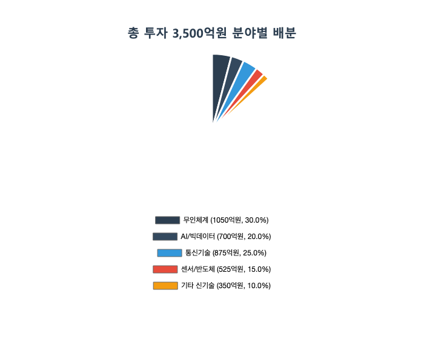

# 테스트 사업계획서

## 1. 사업 개요
AI 기반 챗봇 서비스는 고객 서비스 자동화를 위한 혁신적인 솔루션입니다.

## 2. 시장 분석
글로벌 챗봇 시장은 연평균 24% 성장하고 있습니다.

<그림 1> 시장 성장률 추이

## 3. 예산 계획
총 사업비는 50억원으로 계획되어 있습니다.

<그림 2> 예산 배분 현황

## 4. 결론
본 사업은 높은 성장 가능성을 보유하고 있습니다.