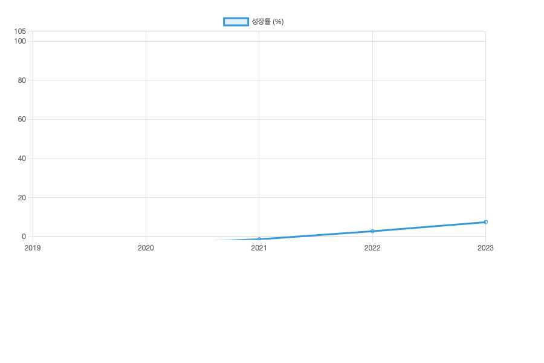
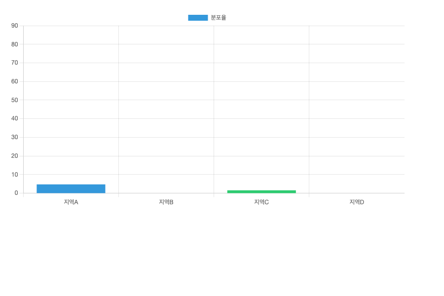
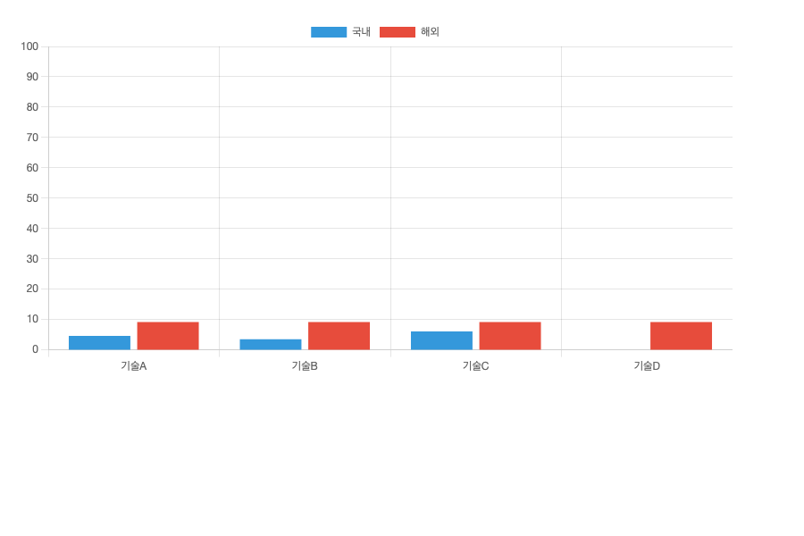
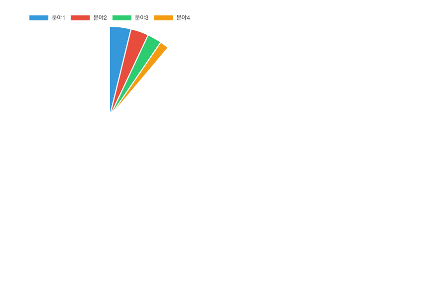
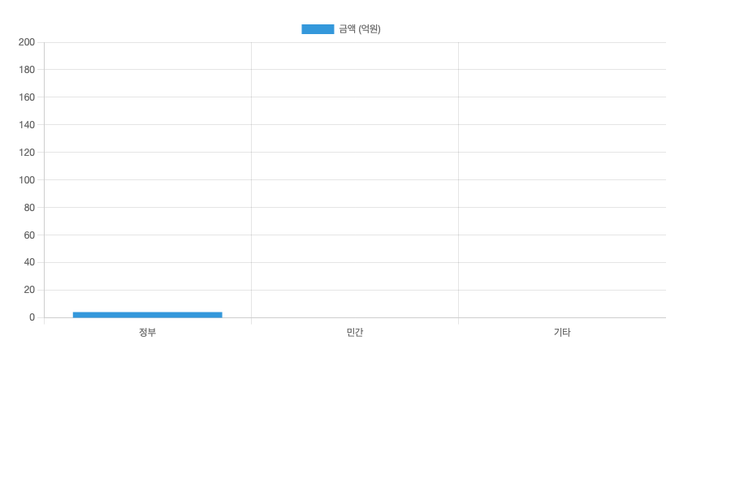

# 테스트 프로젝트 사업계획서

## 1. 사업 개요

### 1.1 사업 목적

이것은 고유 차트 생성 테스트용 프로젝트입니다.

<그림 1> 연간 성장 추이

### 1.2 현황 분석

| 연도 | 매출 (억원) | 성장률 (%) |
|------|-------------|-----------|
| 2019 | 150 | 5.2 |
| 2020 | 280 | 18.5 |
| 2021 | 420 | 22.1 |
| 2022 | 670 | 35.8 |
| 2023 | 950 | 42.3 |

<표 1> 연도별 매출 현황

<그림 2> 지역별 분포 현황

## 2. 기술 분석

### 2.1 기술 수준

<그림 3> 기술 수준 비교

### 2.2 투자 계획

<그림 4> 투자 계획

### 2.3 재원 조달

<그림 5> 재원 조달 계획