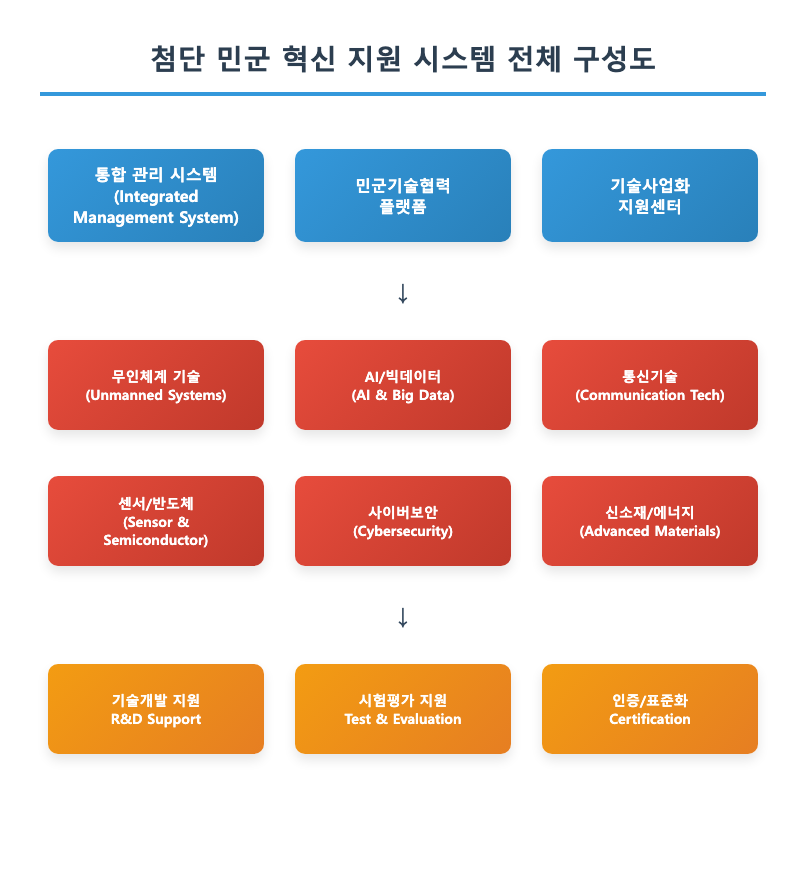

# 실화상 카메라 기반 장거리 드론탐지시스템 구축 사업계획서

## 목차

1. 사업 개요 ················································ 1
　1.1 사업 목적 ·········································· 2
　1.2 추진 배경 ·········································· 3
　1.3 사업 개요 ·········································· 4

2. 기술 분석 ················································ 5
　2.1 탐지 기술 현황 ····································· 6
　2.2 실화상 센서 기술 ··································· 7
　2.3 장거리 탐지 알고리즘 ······························ 8

3. 시장 분석 ················································ 9
　3.1 드론 위협 현황 ···································· 10
　3.2 대드론 시장 전망 ································· 11
　3.3 경쟁 기술 분석 ··································· 12

4. 시스템 설계 ·············································· 13
　4.1 시스템 아키텍처 ··································· 14
　4.2 센서 융합 기술 ··································· 15
　4.3 성능 요구사항 ···································· 16

5. 투자 계획 ··············································· 17
　5.1 총 투자 규모 ····································· 18
　5.2 분야별 투자 계획 ································· 19
　5.3 연도별 추진 일정 ································· 20

6. 기대 효과 ··············································· 21
　6.1 기술적 효과 ······································ 22
　6.2 경제적 효과 ······································ 23

---

## 1. 사업 개요

### 1.1 사업 목적

본 사업의 목적은 실화상 카메라 기반 첨단 센서 기술을 활용하여 장거리 드론 탐지 시스템을 구축하는 것입니다.

핵심 기술^1^[열화상 센서, AI 영상분석, 원거리 탐지 알고리즘]을 활용하여 다음과 같은 목표를 달성하고자 함

□ 주요 목표 1: 장거리 드론 탐지
  ○ 10km 이상 거리에서 소형 드론 탐지
  ○ 다양한 기상 조건에서 안정적 탐지

□ 주요 목표 2: 실시간 위협 분석
  ○ AI 기반 드론 행동 패턴 분석
  ○ 위험도 자동 판별 및 경보 시스템

□ 주요 목표 3: 통합 관제 시스템
  ○ 다중 센서 융합 탐지 기술
  ○ 중앙 통제소 연동 및 데이터 공유

### 1.2 추진 배경

□ 정책적 배경

국가 중요시설 보안 강화 정책에 따라 드론 위협에 대한 종합적 대응체계 구축이 시급한 상황임

□ 기술적 배경

기존 레이더 기반 탐지 시스템의 한계를 극복하고, 소형 드론에 대한 탐지 성능을 획기적으로 향상시킬 필요

□ 사회적 필요성

최근 드론을 이용한 테러 위협이 증가하고 있어 선제적 대응 기술 개발이 필요한 상황

### 1.3 사업 개요

<그림 1> 실화상 카메라 기반 드론 탐지 시스템 개요도

본 사업은 총 4년에 걸쳐 180억원 규모로 추진됨

□ 사업 규모
  ○ 총 사업비: 180억원
  ○ 사업 기간: 2024년 ~ 2027년 (4년)
  ○ 참여 기관: 주관 1개, 공동연구 3개 기관

□ 주요 개발 내용
  ○ 실화상 센서 모듈 개발
  ○ 장거리 탐지 알고리즘 개발
  ○ 통합 관제 시스템 구축

---

## 2. 기술 분석

### 2.1 탐지 기술 현황

□ 국내외 기술 수준 비교

현재 국내 드론 탐지 기술은 해외 선진국 대비 70% 수준이며, 실화상 기반 기술 분야에서는 더욱 격차가 큼

| 기술 분야 | 국내 수준 | 해외 수준 | 격차 | 주요 선도국 |
|-----------|-----------|-----------|------|-------------|
| 레이더 탐지 | 75% | 100% | -25% | 미국, 이스라엘 |
| 실화상 탐지 | 60% | 100% | -40% | 미국, 독일 |
| AI 분석 | 80% | 100% | -20% | 미국, 중국 |
| 센서 융합 | 65% | 100% | -35% | 이스라엘, 프랑스 |
| 통합 관제 | 70% | 100% | -30% | 미국, 영국 |

<표 1> 드론 탐지 기술 분야별 수준 비교

□ 기술 트렌드 분석

최근 드론 탐지 기술은 다음과 같은 방향으로 발전하고 있음:
  ○ 멀티스펙트럴 센서 융합 기술
  ○ AI 기반 실시간 영상 분석
  ○ 초장거리 탐지 성능 향상

### 2.2 실화상 센서 기술

□ 실화상 센서 특성

실화상(열화상) 센서는 기존 가시광 센서 대비 다음과 같은 장점을 보유

| 특성 | 가시광 센서 | 실화상 센서 | 비고 |
|------|-------------|-------------|------|
| 야간 탐지 | 제한적 | 우수 | 24시간 운용 가능 |
| 기상 영향 | 높음 | 낮음 | 안개, 연무 관통 |
| 위장 구별 | 어려움 | 용이 | 열신호 기반 탐지 |
| 탐지 거리 | 5km | 12km | 장거리 탐지 가능 |
| 오탐지율 | 높음 | 낮음 | 정확도 향상 |

<표 2> 센서별 성능 비교

□ 센서 기술 로드맵

| 단계 | 기간 | 목표 성능 | 주요 기술 |
|------|------|-----------|----------|
| 1단계 | 2024년 | 8km 탐지 | 기본 열화상 센서 |
| 2단계 | 2025년 | 12km 탐지 | 고해상도 센서 |
| 3단계 | 2026년 | 15km 탐지 | 센서 융합 기술 |
| 4단계 | 2027년 | 20km 탐지 | AI 기반 향상 |

<표 3> 단계별 센서 기술 개발 계획

### 2.3 장거리 탐지 알고리즘

□ 핵심 알고리즘 기술

장거리 드론 탐지를 위한 핵심 알고리즘은 다음과 같음:
  ○ 배경 차분 기반 움직임 탐지
  ○ 딥러닝 기반 객체 분류
  ○ 다중 프레임 추적 알고리즘
  ○ 거짓 경보 제거 기술

□ 성능 목표

| 성능 지표 | 현재 수준 | 목표 수준 | 개선율 |
|-----------|-----------|-----------|--------|
| 탐지 거리 | 5km | 15km | 300% |
| 탐지율 | 85% | 95% | 10%p |
| 오탐지율 | 15% | 5% | -10%p |
| 처리 속도 | 10fps | 30fps | 300% |
| 반응 시간 | 3초 | 1초 | -67% |

<표 4> 알고리즘 성능 개선 목표

---

## 3. 시장 분석

### 3.1 드론 위협 현황

□ 국내 드론 위협 사례

최근 3년간 국내 드론 관련 보안 사건이 급증하고 있음

| 연도 | 침입 사건 (건) | 중요시설 대상 | 미확인 드론 | 총 신고 건수 |
|------|----------------|---------------|-------------|-------------|
| 2021 | 45 | 12 | 120 | 850 |
| 2022 | 73 | 28 | 180 | 1,250 |
| 2023 | 95 | 41 | 240 | 1,680 |
| 2024E | 130 | 58 | 320 | 2,200 |
| 2025E | 170 | 75 | 410 | 2,800 |

<표 5> 연도별 드론 위협 현황

□ 주요 위협 유형

드론 위협은 다음과 같은 유형으로 분류됨:
  ○ 테러/공격용: 15%
  ○ 정보 수집: 25%
  ○ 밀수/운송: 20%
  ○ 단순 침입: 40%

### 3.2 대드론 시장 전망

□ 글로벌 시장 규모

| 연도 | 시장 규모 (억달러) | 성장률 (%) | 한국 시장 (억원) |
|------|-------------------|------------|-----------------|
| 2023 | 25.8 | - | 3,400 |
| 2024 | 32.4 | 25.6 | 4,300 |
| 2025 | 41.8 | 29.0 | 5,500 |
| 2026 | 54.3 | 29.9 | 7,150 |
| 2027 | 70.6 | 30.0 | 9,300 |
| 2028 | 91.8 | 30.0 | 12,100 |

<표 6> 대드론 시장 전망

□ 분야별 시장 점유율

| 분야 | 현재 점유율 | 2027년 전망 | 성장 동력 |
|------|-------------|-------------|----------|
| 탐지 시스템 | 45% | 40% | 성숙 시장 |
| 무력화 시스템 | 30% | 35% | 기술 발전 |
| 통합 솔루션 | 20% | 35% | 수요 증가 |
| 서비스 | 5% | 10% | 신규 영역 |

<표 7> 분야별 시장 점유율 전망

### 3.3 경쟁 기술 분석

□ 주요 경쟁사 현황

| 회사 | 국가 | 주요 기술 | 시장점유율 | 강점 | 약점 |
|------|------|-----------|------------|------|------|
| Raytheon | 미국 | 레이더 융합 | 25% | 기술력 | 높은 가격 |
| Rafael | 이스라엘 | 다중센서 | 20% | 실전 경험 | 폐쇄성 |
| Thales | 프랑스 | EO/IR | 15% | 센서 기술 | AI 부족 |
| Rohde&Schwarz | 독일 | 전자전 | 12% | 통신 기술 | 탐지 한계 |
| 한화시스템 | 한국 | 레이더 | 8% | 가격 경쟁력 | 기술 격차 |

<표 8> 주요 경쟁사 분석

---

## 4. 시스템 설계

### 4.1 시스템 아키텍처

<그림 2> 실화상 기반 드론 탐지 시스템 구성도

□ 주요 구성 요소

시스템은 다음 4개 주요 모듈로 구성됨:
  ○ 센서 모듈: 실화상/가시광 복합 센서
  ○ 처리 모듈: AI 기반 영상 분석 장치
  ○ 통제 모듈: 중앙 관제 및 의사결정
  ○ 통신 모듈: 네트워크 및 데이터 전송

□ 시스템 사양

| 항목 | 사양 | 비고 |
|------|------|------|
| 탐지 거리 | 15km | 소형 드론 기준 |
| 동시 추적 | 50개체 | 최대 성능 |
| 반응 시간 | 1초 이내 | 탐지 후 경보 |
| 운용 환경 | -20~50℃ | 전천후 운용 |
| 전력 소모 | 500W | 태양광 연동 |

<표 9> 시스템 주요 사양

### 4.2 센서 융합 기술

□ 다중 센서 융합 구조

실화상 센서와 가시광 센서의 융합을 통해 탐지 성능을 극대화

| 센서 유형 | 주간 성능 | 야간 성능 | 악천후 성능 | 융합 효과 |
|-----------|-----------|-----------|-------------|----------|
| 실화상 | 85% | 95% | 90% | 기본 탐지 |
| 가시광 | 95% | 20% | 40% | 정밀 식별 |
| 융합 시스템 | 98% | 95% | 95% | 최적 성능 |

<표 10> 센서 융합 성능 비교

□ AI 기반 융합 알고리즘

  ○ 센서별 신뢰도 가중치 적용
  ○ 실시간 환경 적응 학습
  ○ 거짓 경보 최소화 로직

### 4.3 성능 요구사항

□ 기능 요구사항

| 기능 | 요구사항 | 검증 방법 |
|------|----------|----------|
| 탐지 성능 | 95% 이상 | 실외 시험 |
| 오탐지율 | 5% 이하 | 장기 운용 |
| 동시 처리 | 50개체 | 부하 테스트 |
| 데이터 처리 | 30fps | 성능 측정 |
| 통신 지연 | 100ms 이하 | 네트워크 테스트 |

<표 11> 주요 성능 요구사항

---

## 5. 투자 계획

### 5.1 총 투자 규모

총 사업비는 180억원이며, 분야별 투자 배분은 다음과 같음

| 분야 | 투자액 (억원) | 비율 (%) | 주요 용도 |
|------|---------------|----------|-----------|
| 기술 개발 | 85 | 47.2 | R&D, 알고리즘 |
| 하드웨어 | 45 | 25.0 | 센서, 장비 |
| 소프트웨어 | 25 | 13.9 | AI, 통합 시스템 |
| 시험/검증 | 15 | 8.3 | 실증, 평가 |
| 기타 | 10 | 5.6 | 관리, 예비비 |
| **합계** | **180** | **100.0** | - |

<표 12> 분야별 투자 계획

### 5.2 연도별 투자 계획

| 연도 | 투자액 (억원) | 누적 (억원) | 주요 개발 내용 |
|------|---------------|-------------|----------------|
| 2024 | 50 | 50 | 기초 연구, 센서 개발 |
| 2025 | 60 | 110 | 알고리즘 개발, 시제품 |
| 2026 | 45 | 155 | 시스템 통합, 시험 |
| 2027 | 25 | 180 | 실증, 상용화 준비 |
| **합계** | **180** | **180** | - |

<표 13> 연도별 투자 일정

### 5.3 투자 재원 조달

| 재원 | 금액 (억원) | 비율 (%) | 조달 계획 |
|------|-------------|----------|-----------|
| 정부 R&D | 108 | 60.0 | 과기부, 국방부 |
| 지자체 | 27 | 15.0 | 경기도, 대전시 |
| 기업 투자 | 36 | 20.0 | 방산업체 컨소시엄 |
| 기타 | 9 | 5.0 | 해외 투자 유치 |
| **합계** | **180** | **100.0** | - |

<표 14> 투자 재원 조달 계획

---

## 6. 기대 효과

### 6.1 기술적 효과

□ 핵심 기술 확보

본 사업을 통해 다음과 같은 핵심 기술을 확보할 예정:
  ○ 실화상 기반 장거리 탐지 기술
  ○ AI 기반 드론 행동 패턴 분석
  ○ 다중 센서 융합 알고리즘
  ○ 실시간 위협 판별 시스템

□ 기술 경쟁력 향상

| 기술 분야 | 현재 수준 | 목표 수준 | 향상 폭 |
|-----------|-----------|-----------|---------|
| 탐지 기술 | 60% | 90% | +30%p |
| AI 분석 | 80% | 95% | +15%p |
| 센서 융합 | 65% | 85% | +20%p |
| 시스템 통합 | 70% | 90% | +20%p |
| 전체 평균 | 69% | 90% | +21%p |

<표 15> 기술 수준 향상 목표

### 6.2 경제적 효과

□ 직접 경제 효과

| 항목 | 규모 | 시기 | 비고 |
|------|------|------|------|
| 매출 창출 | 500억원 | 2025~2030 | 시스템 판매 |
| 수출 효과 | 200억원 | 2027~2030 | 해외 진출 |
| 고용 창출 | 200명 | 2024~2027 | 연구인력 중심 |
| 기업 성장 | 15% | 2025년 | 참여기업 매출 |

<표 16> 직접 경제 효과

□ 간접 경제 효과

  ○ 방산 수출 기여: 연간 50억원 규모
  ○ 관련 산업 파급: 300억원 규모  
  ○ 국가 안보 강화: 무형의 가치
  ○ 기술 혁신 생태계: 장기적 효과

□ 사회적 효과

본 사업을 통해 다음과 같은 사회적 효과를 기대:
  ○ 국가 중요시설 보안 강화
  ○ 드론 테러 위협 대응 능력 향상  
  ○ 첨단 방산 기술력 확보
  ○ 국민 안전 의식 제고

---

## 주석

1. 실화상 센서: 물체가 방사하는 적외선 에너지를 감지하여 온도 분포를 영상으로 나타내는 센서 기술. 야간이나 악천후에도 안정적인 탐지 성능을 제공함.