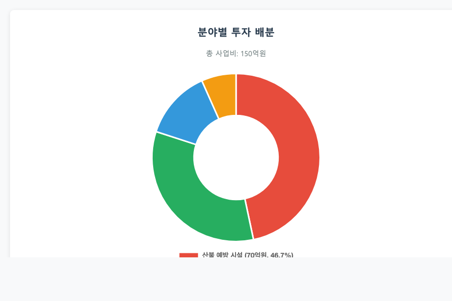

# 봉화지역 산불방지 및 산림복구 사업제안서

## 목차

1. 사업 개요 ················································ 1
　1.1 사업 목적 ·········································· 2
　1.2 추진 배경 ·········································· 3
　1.3 사업 개요 ·········································· 4

2. 지역 현황 분석 ·········································· 5
　2.1 봉화군 일반 현황 ··································· 6
　2.2 산림 현황 ·········································· 7
　2.3 산불 발생 현황 ····································· 8

3. 사업 추진 계획 ·········································· 9
　3.1 산불 예방 사업 ····································· 10
　3.2 산림복구 사업 ····································· 11
　3.3 추진 조직 ········································ 12

4. 투자 계획 ··············································· 13
　4.1 총 투자 규모 ····································· 14
　4.2 연도별 투자 계획 ································· 15
　4.3 투자 재원 조달 ··································· 16

5. 기대 효과 ··············································· 17
　5.1 환경적 효과 ······································ 18
　5.2 경제적 효과 ······································ 19

---

## 1. 사업 개요

### 1.1 사업 목적

본 사업의 목적은 봉화군 지역의 산불 예방 및 대응 체계를 강화하고 훼손된 산림을 복구하여 지속가능한 산림 관리 기반을 구축하는 것임

핵심 기술^1^[첨단 산불 감시 기술과 무인 항공기를 활용한 조기 탐지 시스템]을 활용하여 다음과 같은 목표를 달성하고자 함

□ 주요 목표 1: 산불 예방 및 조기 대응 체계 구축
  ○ 첨단 산불 감시 시설 설치
  ○ 무인 항공기 기반 조기 탐지 시스템 도입

□ 주요 목표 2: 훼손된 산림의 체계적 복구
  ○ 산불 피해지 복구 및 조림 사업
  ○ 토양 안정화 및 생태계 복원

### 1.2 추진 배경

□ 정책적 배경

정부의 탄소중립 2050 정책에 따라 산림의 탄소 흡수원 기능 강화와 지속가능한 산림 관리가 필요한 상황임

□ 지역적 배경

봉화군은 경북 북부 산간 지역으로 전체 면적 1,201.48㎢ 중 산림면적이 98,141ha(81.7%)를 차지하는 산림 의존도가 높은 지역임^2^[봉화군은 태백산맥과 소백산맥이 만나는 산간 지역으로 산림 밀도가 매우 높음]

□ 기후 변화 대응 배경

최근 기후 변화로 인한 산불 위험도 증가와 봄철 건조한 날씨로 인한 산불 발생 빈도 증가에 대한 선제적 대응이 필요함

### 1.3 사업 개요

<그림 1> 사업 전체 개요도

본 사업은 총 3년(2025-2027)에 걸쳐 150억원 규모로 추진됨

---

## 2. 지역 현황 분석

### 2.1 봉화군 일반 현황

□ 지리적 위치

봉화군은 경상북도 북부에 위치하며 동경 128°38′∼129°12′, 북위 36°44′∼37°06′에 위치함

  ○ 동쪽: 울진군
  ○ 서쪽: 영주시  
  ○ 남쪽: 안동시, 영양군
  ○ 북쪽: 강원특별자치도 영월군, 삼척시, 태백시

□ 행정구역 및 인구

| 구분 | 현황 |
|------|------|
| 행정구역 | 1읍 9면 |
| 총 면적 | 1,201.48㎢ |
| 인구 | 29,356명(2024년 기준) |
| 세대수 | 16,761세대 |

<표 1> 봉화군 기본 현황

### 2.2 산림 현황

□ 산림면적 현황

봉화군 관할 산림면적은 남부지방산림청 관할구역 내에서 가장 넓은 면적을 차지함

<그림 2> 남부지방산림청 관할 지역별 산림면적

| 구분 | 면적(ha) | 전체 면적 대비(%) |
|------|----------|------------------|
| 총 면적 | 120,148 | 100.0 |
| 산림면적 | 98,141 | 81.7 |
| 농경지 | 12,302 | 10.2 |
| 기타 | 9,705 | 8.1 |

<표 2> 봉화군 토지 이용 현황

□ 산림 구성

  ○ 침엽수림: 춘양목(금강소나무)을 비롯한 소나무림이 주를 이룸
  ○ 활엽수림: 참나무류, 자작나무 등 혼재
  ○ 혼효림: 침엽수와 활엽수가 혼재된 산림

### 2.3 산불 발생 현황

□ 전국 산불 발생 현황

2024년 전국 산불 발생 현황에 따르면 경상북도는 31건의 산불이 발생하여 전국 상위 지역에 해당함^3^[2024년 전국 산불 통계에 따르면 경기도 82건, 충남 35건, 경북 31건 순으로 발생]

<그림 3> 2024년 지역별 산불 발생 현황

□ 산불 발생 원인

<그림 4> 산불 발생 원인별 통계

  ○ 입산자 실화: 18%
  ○ 논·밭두렁 및 쓰레기 소각: 19%
  ○ 기타 원인: 63%

□ 시기별 발생 현황

봄철(2.1~5.15) 산불 조심 기간에 전체 산불의 57%가 집중 발생하며, 특히 3월에 가장 많이 발생함

---

## 3. 사업 추진 계획

### 3.1 산불 예방 사업

□ 첨단 감시 시설 구축

□ 1단계: 산불 감시 카메라 설치
  ○ 고해상도 열화상 카메라 20개소 설치
  ○ 주요 산맥 및 취약 지역 우선 설치

□ 2단계: 무인 항공기 감시 시스템 도입
  ○ 드론 기반 실시간 감시 체계 구축
  ○ AI 기반 화재 조기 탐지 시스템 도입

□ 예방 시설 정비

□ 산불 방지선 설치
  ○ 주요 등산로 및 임도 주변 방지선 설치
  ○ 총 연장 50km 구간 정비

□ 진입로 및 저수시설 확충
  ○ 산불 진화용 임도 정비 20km
  ○ 진화용 저수조 10개소 신설

### 3.2 산림복구 사업

□ 산불 피해지 복구

최근 산불 피해지 및 벌채지를 대상으로 체계적인 복구 사업을 추진함

<그림 5> 산림복구 사업 추진 계획

□ 조림 사업
  ○ 피해지 조림: 300ha
  ○ 수종: 소나무, 낙엽송, 참나무류 혼효 조림
  ○ 연차별 조림 계획 수립

□ 생태 복원 사업
  ○ 토양 안정화 작업
  ○ 산사태 방지 시설 설치
  ○ 야생동물 서식지 복원

### 3.3 추진 조직

<그림 6> 사업 추진 조직도

□ 조직 구성

□ 사업총괄팀
  ○ 팀장: 봉화군수
  ○ 구성원: 봉화군 산림공원과, 남부지방산림청
  ○ 역할: 전체 사업 관리 및 조정

□ 예방사업팀
  ○ 팀장: 남부지방산림청 산불관리과장
  ○ 구성원: 산불 전문가, 기술진
  ○ 역할: 산불 예방 시설 설치 및 운영

□ 복구사업팀
  ○ 팀장: 봉화군 산림공원과장
  ○ 구성원: 산림복구 전문가, 조림 기술진
  ○ 역할: 산림복구 및 조림 사업 추진

---

## 4. 투자 계획

### 4.1 총 투자 규모

총 사업비는 150억원이며, 분야별 투자 계획은 다음과 같음

<그림 7> 분야별 투자 배분

| 분야 | 투자액 (억원) | 비율 (%) | 주요 용도 |
|------|---------------|----------|-----------|
| 산불 예방 시설 | 70 | 46.7 | 감시 카메라, 드론 시스템 |
| 산림복구 | 50 | 33.3 | 조림, 생태 복원 |
| 진화 인프라 | 20 | 13.3 | 임도, 저수시설 |
| 운영비 | 10 | 6.7 | 인건비, 유지관리 |
| 합계 | 150 | 100.0 | - |

<표 3> 분야별 투자 계획

### 4.2 연도별 투자 계획

| 연도 | 투자액 (억원) | 누적 (억원) | 주요 투자 분야 |
|------|---------------|-------------|----------------|
| 2025 | 60 | 60 | 감시 시설 구축 |
| 2026 | 60 | 120 | 복구 사업 집중 |
| 2027 | 30 | 150 | 사후 관리 |
| **합계** | **150** | **150** | - |

<표 4> 연도별 투자 계획

<그림 8> 연도별 투자 추이

### 4.3 투자 재원 조달

투자 재원은 다음과 같이 조달할 계획임

| 재원 | 금액 (억원) | 비율 (%) | 비고 |
|------|-------------|----------|------|
| 국비 | 90 | 60.0 | 산림청 지원 |
| 도비 | 30 | 20.0 | 경상북도 지원 |
| 군비 | 30 | 20.0 | 봉화군 자체 예산 |
| 합계 | 150 | 100.0 | - |

<표 5> 투자 재원 조달 계획

---

## 5. 기대 효과

### 5.1 환경적 효과

□ 산림 생태계 복원

본 사업을 통해 다음과 같은 환경적 효과가 예상됨^4^[산림복구를 통한 생태계 서비스 가치 증진 효과]

  ○ 산림 탄소 흡수량 증대: 연간 1,500톤 CO₂ 흡수
  ○ 생물다양성 증진: 야생동물 서식지 복원
  ○ 수자원 함양: 지하수 충전량 증가

□ 대기질 개선

| 구분 | 효과 | 규모 | 비고 |
|------|------|------|------|
| 미세먼지 저감 | 대기질 개선 | 10% 개선 | 복구지 기준 |
| 산소 공급 | 산림 기능 회복 | 연간 1,200톤 | 조림지 성장 후 |
| 기온 조절 | 열섬 현상 완화 | 2℃ 저감 | 산림 지역 |

<표 6> 환경적 효과

<그림 9> 환경 효과 전망

### 5.2 경제적 효과

□ 직접 경제 효과

□ 산림 자원 가치 증대
  ○ 목재 자원 가치: 50억원(성숙 시점)
  ○ 임산물 생산 증대: 연간 5억원
  ○ 관광 자원 개발: 연간 10억원

□ 간접 경제 효과

| 구분 | 효과 | 규모 | 비고 |
|------|------|------|------|
| 고용 창출 | 일자리 창출 | 100명 | 직간접 포함 |
| 지역경제 활성화 | 소득 증대 | 연간 20억원 | 관련 산업 |
| 재해 예방 | 피해 절감 | 연간 30억원 | 산불 피해 방지 |

<표 7> 경제적 효과

---

## 6. 추진 일정

### 6.1 연차별 추진 계획

<그림 10> 세부 추진 일정

주요 마일스톤

  2025년 3월: 사업 착수
  2025년 12월: 1차년도 완료(감시 시설)
  2026년 12월: 2차년도 완료(복구 사업)
  2027년 12월: 전체 사업 완료

### 6.2 단계별 성과 목표

| 단계 | 기간 | 주요 성과 목표 | 성과지표 |
|------|------|---------------|----------|
| 1단계 | 2025년 | 감시 체계 구축 | 감시 시설 20개소 |
| 2단계 | 2026년 | 산림복구 완료 | 조림 300ha |
| 3단계 | 2027년 | 사후 관리 | 생존율 90% |

<표 8> 단계별 성과 목표

---

## 결론

본 사업은 봉화군 지역의 산불 예방과 산림복구를 통해 지속가능한 산림 관리 기반을 구축하고 기후변화 대응에 기여할 것으로 기대됨

체계적인 추진 계획과 단계별 성과 관리를 통해 성공적인 사업 완수를 위해 최선을 다함

---

【 중요 주석 】

^1^[첨단 산불 감시 기술과 무인 항공기를 활용한 조기 탐지 시스템: AI 기반 화재 인식 알고리즘과 실시간 영상 분석 기술을 통합한 시스템]
^2^[봉화군은 태백산맥과 소백산맥이 만나는 산간 지역으로 산림 밀도가 매우 높음: 해발 1,000m 이상의 높은 산들이 북부 경계를 이루고 있으며 전국에서 산림 비율이 가장 높은 지역 중 하나]
^3^[2024년 전국 산불 통계에 따르면 경기도 82건, 충남 35건, 경북 31건 순으로 발생: 산림청 발표 2024년 산불 발생 현황 통계 자료]
^4^[산림복구를 통한 생태계 서비스 가치 증진 효과: 탄소 흡수, 수자원 함양, 생물다양성 증진 등 산림의 공익적 기능 강화]