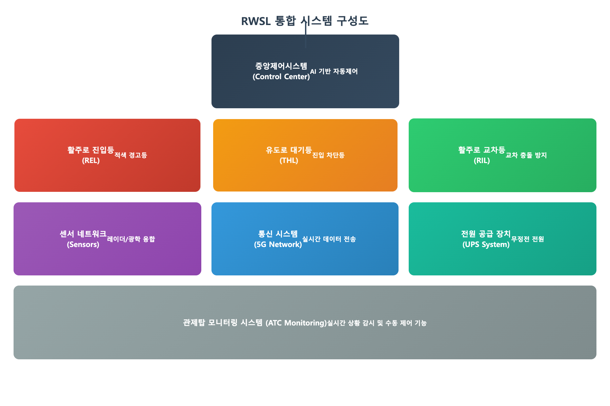

# 사업계획서 서식 작성 가이드

## 📝 기본 서식 규칙

### 제목 체계
```
# 문서 제목 (H1)
## 대분류 제목 (H2) 
### 중분류 제목 (H3)
#### 소분류 제목 (H4)
```

### 목차 서식
```
1. 사업 개요 ················································ 1
　1.1 사업 목적 ·········································· 2
　1.2 추진 배경 ·········································· 3

2. 시장 분석 ················································ 5
　2.1 시장 현황 ·········································· 6
　2.2 경쟁사 분석 ······································· 7
```

**포인트:**
- 대항목: `1. 2. 3.` (숫자 + 점)
- 중항목: `　1.1 1.2` (전각 공백 + 숫자.숫자)
- 점선: `·` (전각 중점) 사용
- 페이지 번호 우측 정렬

## 🔘 불릿 포인트 서식

### 계층별 불릿 기호
```
□ 대항목 (검은 네모)
  ○ 중항목 (흰 원)
  - 소항목 (하이픈)
  • 세부항목 (검은 점)
```

### 사용 예시
```
□ 주요 목표 1
  ○ 세부 목표 1-1
  ○ 세부 목표 1-2
    - 구체적 내용 1
    - 구체적 내용 2
      • 상세 설명 1
      • 상세 설명 2

□ 주요 목표 2
  ○ 세부 목표 2-1
  ○ 세부 목표 2-2
```

**주의사항:**
- **절대 금지**: ①②③ 같은 원 숫자 사용 금지
- 들여쓰기: 2칸씩 증가
- 일관성: 동일 레벨에서는 동일한 기호 사용

## 📊 표와 그림 서식

### 표 서식
```markdown
<표 1> 표 제목은 위에 위치

| 항목 | 내용 | 비고 |
|------|------|------|
| 데이터1 | 값1 | 설명1 |
| 데이터2 | 값2 | 설명2 |
```

### 그림 서식
```markdown

<그림 1> 그림 제목은 아래에 위치
```

**캡션 위치 규칙:**
- **표**: 캡션이 **위**에 위치 (`<표 1> 제목`)
- **그림**: 캡션이 **아래**에 위치 (`<그림 1> 제목`)

## 🖼️ 이미지 파일명 규칙

### 파일명 패턴
```
[프로젝트명]_[차트유형]_chart.png
```

### 차트 유형별 파일명
- 시스템 구성도: `프로젝트명_system_architecture.png`
- 시장 전망: `프로젝트명_market_forecast_chart.png`
- 투자 계획: `프로젝트명_investment_allocation_chart.png`
- 기술 로드맵: `프로젝트명_tech_roadmap.png`
- 조직도: `프로젝트명_organization_chart.png`
- 일정: `프로젝트명_project_schedule_chart.png`
- 경제 효과: `프로젝트명_economic_impact_chart.png`
- 리스크 분석: `프로젝트명_risk_matrix.png`

### 이미지 삽입 예시
```markdown

<그림 2> RWSL 통합 시스템 구성도


<그림 3> AI 헬스케어 시장 전망 (2024-2030)
```

## 📋 텍스트 서식

### 강조 표현
```markdown
**굵은 글씨**: 중요한 내용
*기울임체*: 부차적 강조
`코드체`: 기술용어, 파일명
```

### 구분선
```markdown
---
```
- 섹션 구분시에만 사용
- 3개 하이픈으로 통일

## 📑 번호 표기 금지사항

### ❌ 사용 금지
```
① ② ③ ④ ⑤  (원 숫자)
❶ ❷ ❸ ❹ ❺  (검은 원 숫자)
⑴ ⑵ ⑶ ⑷ ⑸  (괄호 숫자)
```

### ✅ 대신 사용
```
□ 항목 1
□ 항목 2  
□ 항목 3

또는

  ○ 세부 항목 1
  ○ 세부 항목 2
  ○ 세부 항목 3
```

## 🎨 차트 생성 서식 요구사항

### CSS 기본 설정
```css
body {
    margin: 0;
    padding: 0;
    background: white;
    font-family: 'Malgun Gothic', 'Apple SD Gothic Neo', sans-serif;
}
.container {
    padding: 15px;
}
```

### 차트 옵션
```javascript
// 애니메이션 완전 금지
animation: false,
responsive: true,
plugins: {
    legend: {
        display: true
    }
}
```

## 📏 레이아웃 규칙

### 단락 간격
- 제목 간 1줄 공백
- 단락 간 1줄 공백
- 섹션 간 구분선(`---`) 사용

### 들여쓰기 규칙
```
□ 대항목 (들여쓰기 없음)
  ○ 중항목 (2칸 들여쓰기)
    - 소항목 (4칸 들여쓰기)
      • 세부항목 (6칸 들여쓰기)
```

## ✅ 완성된 서식 예시

```markdown
# 스마트팜 IoT 시스템 사업계획서

## 목차

1. 사업 개요 ················································ 1
　1.1 사업 목적 ·········································· 2
　1.2 추진 배경 ·········································· 3

---

## 1. 사업 개요

### 1.1 사업 목적

□ 스마트팜 기술 상용화
  ○ IoT 센서 기반 모니터링 시스템 구축
  ○ AI 기반 자동화 제어 시스템 개발
    - 환경 데이터 실시간 수집
    - 자동 급수/급비 시스템
      • 토양 습도 센서 연동
      • 영양분 농도 자동 조절

□ 농업 생산성 향상
  ○ 수확량 20% 증대 목표
  ○ 인력 비용 30% 절감 목표


<그림 1> 스마트팜 IoT 시스템 구성도

<표 1> 기대 효과 분석

| 분야 | 기존 방식 | 스마트팜 | 개선 효과 |
|------|-----------|----------|-----------|
| 수확량 | 100% | 120% | 20% 증가 |
| 인력비용 | 100% | 70% | 30% 절감 |

---
```

이제 이 가이드를 따르면 일관성 있고 전문적인 사업계획서를 작성할 수 있습니다!