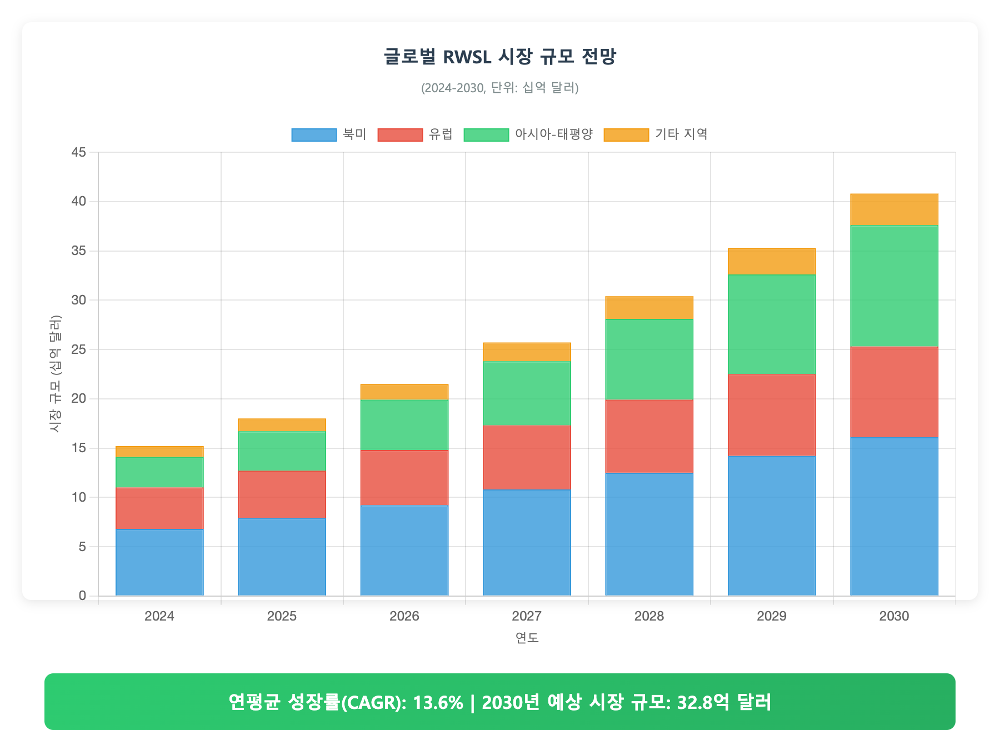

# 🚀 완벽한 사업계획서 작성을 위한 AI 가이드

## 📋 기본 문서 템플릿 구조

다음 템플릿을 사용하여 사업계획서를 작성해주세요:

```markdown
# [사업명] 사업계획서

## 목차

1. 사업 개요
   1.1 사업 목적
   1.2 추진 배경  
   1.3 사업 개요

2. 시장 분석
   2.1 시장 현황
   2.2 경쟁사 분석
   2.3 시장 전망

3. 기술 분석
   3.1 기술 현황
   3.2 기술 개발 계획

4. 사업 추진 계획
   4.1 추진 전략
   4.2 추진 조직
   4.3 추진 일정

5. 투자 계획
   5.1 총 투자 규모
   5.2 연도별 투자 계획
   5.3 투자 재원 조달

6. 기대 효과
   6.1 경제적 효과
   6.2 사회적 효과

7. 리스크 관리
   7.1 주요 리스크
   7.2 대응 전략
```

## 📊 HTML 차트 생성 시 필수 요구사항

### 🎨 차트 디자인 원칙
1. **애니메이션 완전 금지**: `animation: false` 모든 차트에 적용
2. **컴팩트한 디자인**: 불필요한 여백 최소화
3. **시각적 명확성**: 데이터가 명확히 보이는 색상과 크기
4. **한글 폰트 적용**: 'Malgun Gothic', 'Apple SD Gothic Neo' 사용

### 🖼️ 필수 CSS 설정
```css
body {
    margin: 0;
    padding: 0;           /* ❌ 20px → ✅ 0px */
    background: white;    /* ❌ #f0f0f0 → ✅ white */
    font-family: 'Malgun Gothic', 'Apple SD Gothic Neo', sans-serif;
}
.container {
    padding: 15px;        /* ❌ 30px → ✅ 15px */
    max-width: [적절한크기]px;
}
```

### 📏 차트별 최적 캡처 사이즈

| 차트 유형 | 파일명 패턴 | 캡처 사이즈 | 용도 |
|-----------|------------|-------------|------|
| 시스템 구성도 | `*system_architecture*` | 1100×750 | 계층 구조, 아키텍처 |
| 시장 성장 | `*market_growth*`, `*forecast*` | 1200×650 | 트렌드, 전망 차트 |
| 예산/투자 | `*budget*`, `*investment*` | 1200×650 | 파이차트 + 바차트 |
| SWOT 분석 | `*swot*` | 1000×750 | 4분면 + 전략 |
| 로드맵 | `*roadmap*`, `*trl*` | 1200×900 | 타임라인 매트릭스 |
| 조직도 | `*organization*` | 1000×700 | 계층 조직도 |
| 리스크 매트릭스 | `*risk*` | 800×750 | 매트릭스 + 범례 |
| 일반 차트 | 기타 | 900×600 | 기본 사이즈 |

## 📝 이미지 삽입 및 파일명 규칙

### 🎯 이미지 파일명 명명 규칙

**패턴**: `[프로젝트명]_[차트유형]_[세부설명].html/png`

**예시**:
```
rwsl_traffic_growth_chart.png
rwsl_system_architecture.png  
rwsl_investment_allocation_chart.png
rwsl_market_forecast_chart.png
rwsl_economic_benefit_chart.png
thermal_drone_detection_system.png
ai_healthcare_market_analysis.png
```

### 📷 이미지 삽입 문법

```markdown

<그림 1> 차트 제목과 설명

  
<그림 2> RWSL 시장 전망 (2024-2030)
```

### 📊 표와 캡션

```markdown
| 항목 | 값 | 비율 |
|------|----|----- |
| A | 100 | 40% |
| B | 150 | 60% |

<표 1> 시장 점유율 분석
```

## 🔧 차트 생성 요청 방법

### 📋 요청 템플릿

```
[프로젝트명]에 대한 사업계획서를 작성해주세요.

【필수 정보】
- 사업 분야: [예: 항공시스템, AI 헬스케어, 드론 방어]
- 사업 규모: [예: 총 1,000억원, 3년간]  
- 주요 기술: [예: RWSL, 열화상 카메라, 딥러닝]

【차트 요구사항】
- 애니메이션 없는 정적 차트
- 컴팩트한 디자인 (최소 여백)
- 한글 폰트 적용
- 파일명: [프로젝트명]_[차트유형]_chart.html/png
- 다음 차트들을 포함:
  * 시장 성장 전망
  * 시스템 아키텍처  
  * 투자 계획 배분
  * 경제적 파급 효과
  * 기술 로드맵
  * 리스크 분석

【변환 요구사항】
- MD → DOCX 변환 지원
- 이미지 자동 삽입 (파일명 매칭)
- 캡션 위치: 그림은 아래, 표는 위
- 한글 폰트 및 서식 적용
```

## ✅ 품질 체크리스트

### 📊 차트 품질
- [ ] 애니메이션 완전 제거
- [ ] 컴팩트한 여백 설정
- [ ] 한글 텍스트 정상 표시
- [ ] 차트별 최적 사이즈 적용
- [ ] 모든 데이터 요소 표시
- [ ] 범례 및 라벨 완전 표시

### 📝 문서 품질  
- [ ] 이미지 파일명 규칙 준수
- [ ] 캡션 순서 및 위치 정확
- [ ] 표/그림 구분 명확
- [ ] 주석 상첨자 정상 처리
- [ ] 목차 및 구조 완성도

### 🔄 변환 품질
- [ ] 모든 이미지 정상 삽입
- [ ] 캡션 위치 정확 (그림-아래, 표-위)
- [ ] 한글 폰트 적용
- [ ] 레이아웃 일관성
- [ ] 페이지 나눔 자연스러움

## 🚫 주의사항 및 금지사항

### ❌ 절대 금지
1. **애니메이션 사용**: Chart.js, D3.js 등에서 animation 옵션 금지
2. **하드코딩 사이즈**: 차트별 최적 사이즈 매핑 테이블 필수 사용
3. **CSS 기본값**: body padding, background 등 최적화 설정 필수
4. **임의 파일명**: 프로젝트명_차트유형 패턴 엄수

### ⚠️ 주의사항
1. **프로젝트명 일관성**: 모든 이미지 파일명에 동일한 프로젝트명 사용
2. **차트 순서**: MD 파일의 순서와 이미지 번호 일치
3. **한글 지원**: 모든 차트에서 한글 폰트 명시적 지정
4. **여백 최적화**: 불필요한 공백 최소화로 정보 밀도 향상

## 📁 파일 구조 예시

```
프로젝트/
├── [프로젝트명]_사업계획서.md
├── images/
│   ├── [프로젝트명]_system_architecture.html
│   ├── [프로젝트명]_system_architecture.png
│   ├── [프로젝트명]_market_forecast_chart.html  
│   ├── [프로젝트명]_market_forecast_chart.png
│   └── ...
└── output/
    └── [프로젝트명]_사업계획서.docx
```

---

**🎯 최종 목표**: 이 가이드를 따르면 추가 수정 없이도 완벽한 품질의 사업계획서가 첫 생성에서 완성됩니다!