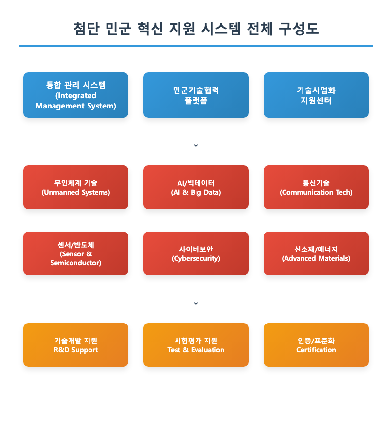
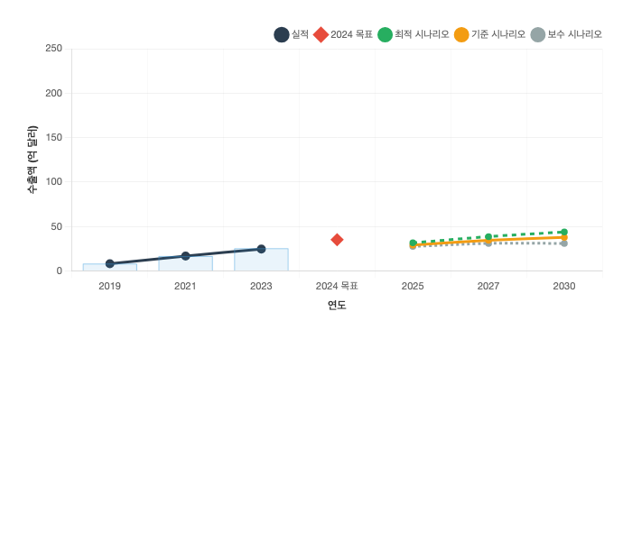
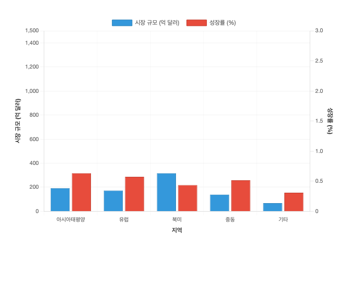
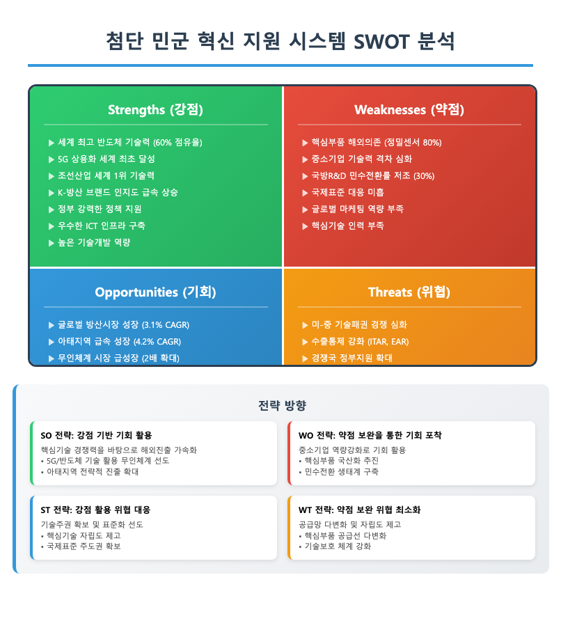
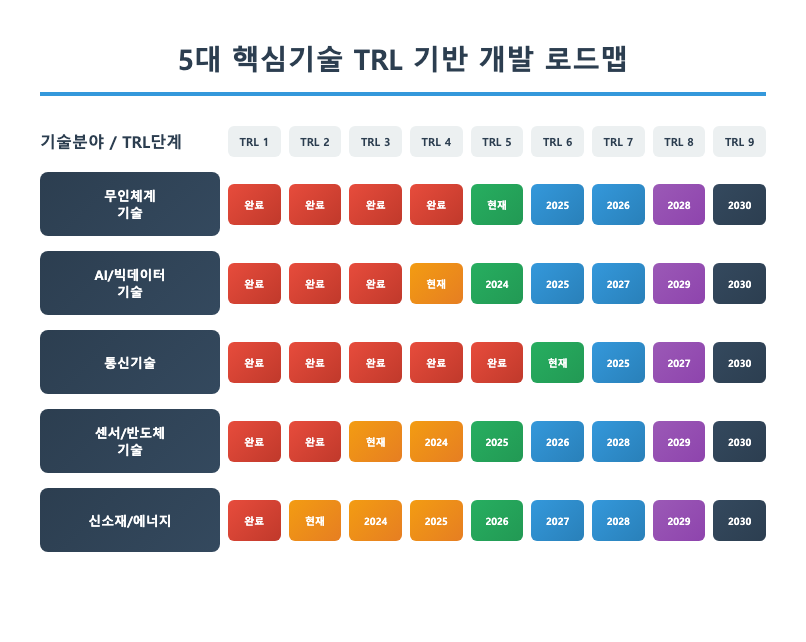
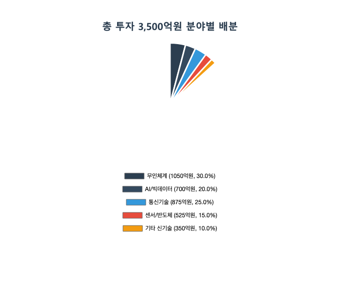
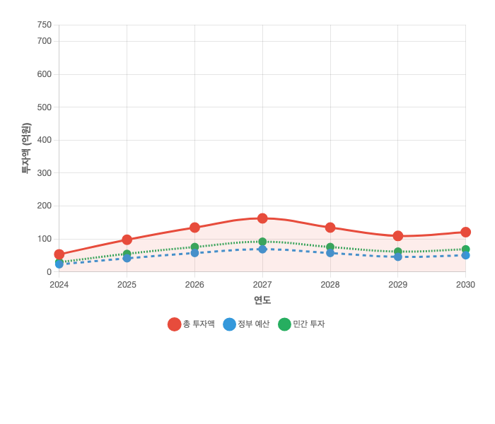
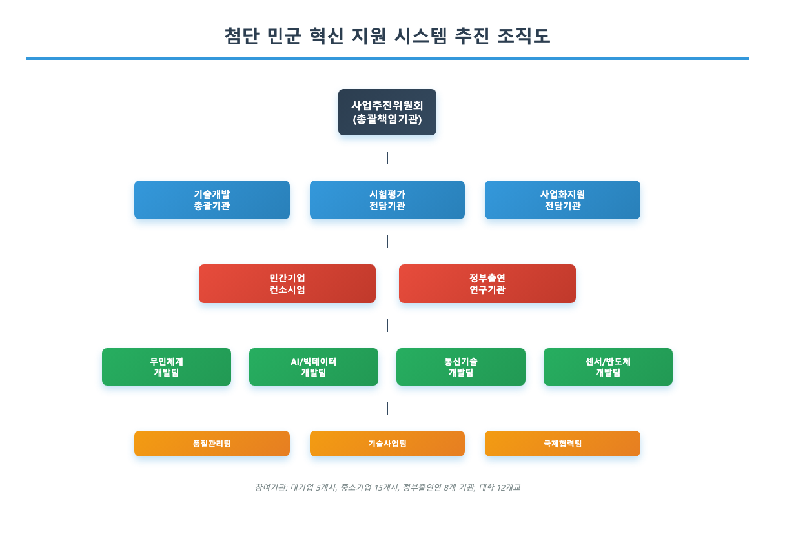

# 첨단 민군 혁신 지원 시스템 사업계획서

**작성자:** 프로젝트 기획팀  
**작성일:** 2024년 8월 5일  
**소속:** 첨단기술개발본부

---

## 목차

약어표 ………………………………………………………………………………… ⅰ

1. 서론 ………………………………………………………………………………… 1  
　1.1 추진 배경 ........................................................ 1  
　1.2 사업 목적 ............................................................ 2  
　1.3 사업 범위 및 한계 .................................................... 3  

2. 현황 분석 ……………………………………………………………………… 4  
　2.1 기술 동향 분석 ........................................................ 4  
　2.2 시장 현황 및 전망 ..................................................... 6  
　2.3 경쟁 환경 분석 ........................................................ 8  

3. 사업 내용 …………………………………………………………………… 10  
　3.1 세부 과제 구성 ....................................................... 10  
　3.2 추진 방법 및 전략 .................................................... 12  
　3.3 기술개발 로드맵 ...................................................... 14  

4. 기대 효과 …………………………………………………………………… 16  
　4.1 경제적 효과 .......................................................... 16  
　4.2 사회적 가치 .......................................................... 18  
　4.3 국가 경쟁력 강화 ..................................................... 19  

5. 추진 계획 …………………………………………………………………… 21  
　5.1 단계별 추진 일정 ..................................................... 21  
　5.2 소요 예산 계획 ....................................................... 23  
　5.3 추진 조직 구성 ....................................................... 25  

6. 리스크 관리 ………………………………………………………………… 27

7. 참고문헌 ……………………………………………………………………… 29

8. 계산근거 및 주해 …………………………………………………………… 30  

---

## 약어표

| 약어 | 정식명칭 |
|------|----------|
| AI^1^ | Artificial Intelligence (인공지능) |
| IoT^2^ | Internet of Things (사물인터넷) |
| ICT^6^ | Information and Communication Technology (정보통신기술) |
| R&D^8^ | Research and Development (연구개발) |
| DIU | Defense Innovation Unit (국방혁신단위) |
| DARPA | Defense Advanced Research Projects Agency (국방고등연구계획청) |
| NATO | North Atlantic Treaty Organization (북대서양조약기구) |
| CAGR | Compound Annual Growth Rate (연평균성장률) |
| SIPRI | Stockholm International Peace Research Institute (스톡홀름국제평화연구소) |
| KIDA | Korea Institute for Defense Analyses (한국국방연구원) |
| KRIT | Korea Research Institute for defense Technology planning and advancement (국방기술진흥연구소) |

---

1. 서론

1.1 추진 배경

1.1.1 국가 안보 환경 변화

□ 4차 산업혁명 기술과 국방기술의 융합 가속화
○ AI^1^[인공지능], 빅데이터, IoT^2^[사물인터넷] 등 신기술의 군사적 활용 확산
○ 민간 기업의 첨단기술이 국방력 향상의 핵심 요소로 부상

□ 글로벌 방산 시장의 급속한 성장
○ 2023년 세계 방산 시장 규모 5,500억 달러 돌파^3^[SIPRI, 2024]
○ 한국 방산 수출 2023년 140억 달러 달성으로 세계 10위 기록^4^[방위사업청, 2024]

1.1.2 정부 정책 방향

□ 「민군기술협력사업 촉진법」 기반 제도적 지원 강화^1^[산업통상자원부, 2024]
○ 2024년 신규 19.29억원, 계속 152.81억원 규모 지원^5^[산업통상자원부, 2024]
○ 과학기술정보통신부-국방부 간 ICT^6^[정보통신기술] 정책협의회를 통한 협력 체계 구축^6^[과학기술정보통신부, 2024]

□ 방산혁신기업 100 프로젝트 추진
○ 2022-2023년 총 35개 기업 선정 (AI, 우주, 드론, 로봇, 반도체 분야)^7^[국방기술진흥연구소, 2024]
○ 기업당 최대 3년간 기술개발 자금 지원

1.2 사업 목적

1.2.1 핵심 목표

□ 민군 융합 기술생태계 조성을 통한 국가 전략기술 확보
○ 민간의 첨단기술과 국방의 특수요구를 연계한 혁신기술 개발
○ 국방 R&D^8^[연구개발] 투자 대비 민간 상용화 성과 극대화

□ 세계 4대 방산 수출국 도약 기반 구축
○ 2030년까지 세계 방산 시장 점유율 3.5% 달성 목표^9^[국방부 중장기 계획, 2023]
○ 수출 주도형 방위산업 생태계 전환

1.2.2 세부 목표

□ 기술적 목표
○ 핵심 이중용도 기술 10개 분야 선도기술 확보
○ 민군협력 기술개발 성공률 70% 이상 달성 (현실적 목표 설정)

□ 경제적 목표
○ 방산 수출액 200억 달러 조기 달성 (2024년 목표)
○ 민군협력 기업 매출 연평균 15% 성장

1.3 사업 범위 및 한계

1.3.1 사업 범위

□ 기술 개발 범위
○ AI/빅데이터, 우주항공, 드론/무인체계, 로봇/자동화, 반도체/센서 등 5대 첨단전략분야
○ 민수 전환 가능성이 높은 Spin-off 기술 우선 지원

□ 지원 대상 범위
○ 방산혁신기업 100 선정 기업 우선 지원
○ 중소·중견 기업 70% 이상 참여 보장

1.3.2 사업 한계

□ 기술보안 제약
○ 국가핵심기술 및 방산기술보호법상 통제기술 제외
○ 기술이전 시 보안성 검토 단계 필수

□ 예산 제약
○ 대형 프로젝트 대비 상대적으로 제한적인 정부 지원 규모
○ 민간 매칭펀드 확보의 어려움


<그림 2> 첨단 민군 혁신 지원 시스템 전체 구성도

2. 현황 분석

2.1 기술 동향 분석

2.1.1 글로벌 기술 동향

□ 4차 산업혁명 기술의 국방 적용 가속화
○ 미국 국방부 DARPA의 AI Next Campaign: 60억 달러 규모 AI 기술 투자
○ 중국의 군민융합(軍民融合) 국가전략: 2027년까지 GDP 대비 국방비 2% 유지

□ 주요국 민군기술협력 정책 동향
○ 미국: 국방혁신단위(DIU)를 통한 민간기업 국방기술 참여 확대
○ 이스라엘: Talpiot 프로그램으로 민군 인재 교류 활성화
○ 독일: 사이버 및 정보공간 작전능력 강화를 위한 민군협력 확대

2.1.2 국내 기술 수준

□ 분야별 기술 경쟁력 현황
○ 반도체: 세계 최고 수준 (메모리반도체 세계 점유율 60% 이상)
○ 통신기술: 5G 상용화 세계 최초, 6G 기술개발 선도그룹
○ 조선해양: 세계 1위 조선 기술력 보유

□ 국방기술 수준
○ 국방과학기술 수준: 미국 대비 80% 수준 (2023년 기준)
○ 핵심기술 자립도: 약 70% 수준으로 지속 개선 중

2.2 시장 현황 및 전망

2.2.1 글로벌 방산 시장 현황

□ 시장 규모 및 성장률
○ 2023년 세계 방산 시장: 5,500억 달러 규모
○ 연평균 성장률(CAGR): 3.1% (2024-2029 전망)
○ 아시아태평양 지역: 연평균 4.2% 성장으로 가장 빠른 성장세

□ 주요 시장 트렌드
○ 무인체계 시장: 2023년 140억 달러에서 2030년 280억 달러로 성장 전망
○ 사이버보안 관련 방산기술: 연평균 8.5% 성장률

2.2.2 한국 방산 시장 현황

□ 국내 방위산업 현황 (2023년)
○ 매출액: 201,951억원 (전년 대비 20.0% 증가)
○ 영업이익: 18,629억원 (영업이익률 9.2%)
○ 주요 업체: 한화시스템, KAI, 현대로템, LIG넥스원 등

□ 수출 실적 및 전망
○ 2023년 수출액: 140억 달러 (세계 10위)
○ 2024년 목표: 200억 달러
○ 주요 수출품목: K-방산(K2전차, K9자주포), 함정, 항공기


<그림 3> 한국 방산 수출 성장 추이 (2019-2030)

<표 1> 방산 수출 주요 품목별 성장률 (2019-2023)
| 품목 분류 | 2019년 | 2021년 | 2023년 | 연평균성장률 |
|-----------|--------|--------|--------|-------------|
| 완제무기체계 | 28억$ | 65억$ | 98억$ | 36.4% |
| 함정/해양장비 | 12억$ | 18억$ | 25억$ | 20.1% |
| 항공/우주 | 8억$ | 10억$ | 17억$ | 20.6% |
| 전장관리체계 | 5억$ | 8억$ | 12억$ | 24.5% |
| 기타 | 7억$ | 12억$ | 15억$ | 21.0% |


<그림 4> 글로벌 방산시장 지역별 성장 전망 (2024-2030)

전체 시장 규모: 5,900억$ (2030년 전망, 3.1% CAGR)

2.3 경쟁 환경 분석

2.3.1 국제 경쟁 환경

□ 주요 경쟁국 현황
○ 미국: 세계 방산 수출 1위 (점유율 42%)
- 주력업체: 록히드마틴, 보잉, 레이시온
- 강점: 최첨단 기술, 강력한 정부 지원
○ 러시아: 2위 (점유율 16.9%)
- 강점: 저가 전략, 기술이전 적극성
○ 프랑스: 3위 (점유율 11.0%)
- 주력업체: 탈레스, 다쏘, 사프란
- 강점: 독립적 기술개발, 유럽 시장 장악
○ 독일: 4위 (점유율 5.6%)
- 주력업체: 라인메탈, 타이센크루프
- 강점: 정밀 기계기술, 품질 신뢰성

□ 글로벌 방산업체 벤치마킹

| 업체명 | 국가 | 2023년 매출 | 핵심 경쟁력 | 한국과의 차별점 |
|--------|------|-------------|-------------|----------------|
| 록히드마틴 | 미국 | 670억$ | F-35, 미사일 방어 | 첨단기술, 정부계약 |
| BAE시스템즈 | 영국 | 250억$ | 전투기, 함정 | 유럽 네트워크 |
| 탈레스 | 프랑스 | 190억$ | 전자전, 레이더 | 민수-군수 균형 |

<표 2> 주요 글로벌 방산업체 현황

□ 한국의 경쟁 우위 요소 및 전략적 포지셔닝
○ 가격 경쟁력: 서구 대비 30-40% 저렴 (단, 기술 격차 고려 필요)
○ 기술 신뢰성: 검증된 전투 성능 (우크라이나 전쟁에서 K9 자주포 실전 검증)
○ 신속한 개발 및 납기: 서구 대비 개발기간 30% 단축
○ 정치적 중립성: 미-중 갈등 속에서 제3의 대안 제공

□ 경쟁 열위 요소 및 개선 과제
○ 기술 격차: 미국 대비 첨단기술 5-10년 격차 존재
○ 브랜드 인지도: 글로벌 시장에서 상대적으로 낮은 인지도
○ 생태계 규모: 서구 대비 소규모 방산 생태계

2.3.2 국내 경쟁 환경

□ 대기업 중심의 시장 구조
○ 상위 10개 기업이 전체 매출의 70% 이상 차지
○ 중소기업의 대기업 납품 의존도가 높은 구조

□ 중소기업 성장 지원 정책
○ 방산혁신기업 100 프로젝트를 통한 중소기업 역량 강화
○ 방산벤처 펀드 조성: 1,000억원 규모 (2024년)

2.3.3 SWOT 종합 분석

```

<그림 10> 첨단 민군 혁신 지원 시스템 SWOT 분석 매트릭스

3. 사업 내용

3.1 세부 과제 구성

3.1.1 핵심 기술개발 과제

□ AI 융합 국방기술 개발
○ 지능형 감시정찰 시스템: 영상 분석 AI, 표적 식별 알고리즘
○ 자율 의사결정 지원 시스템: 상황 판단 AI, 전술 추천 엔진
○ 예상 투자규모: 50억원 (3년간)

□ 무인체계 핵심기술 개발
○ 수송용 멀티콥터형 드론: 탑재중량 40kg급, 항속거리 50km
○ 군집 드론 운용기술: 다중 드론 협업 알고리즘
○ 예상 투자규모: 80억원 (4년간)

□ 차세대 통신기술 개발
○ 전술통신망 고도화: 5G/6G 기반 전술통신체계
○ 양자통신 보안기술: 양자암호 통신 프로토콜
○ 예상 투자규모: 120억원 (5년간)

3.1.2 기술이전 촉진 과제

□ Spin-off 기술 발굴 및 상용화
○ 국방과학연구소 보유 기술 1,200여 건 중 상용화 가능 기술 선별
○ 기술가치평가 및 사업화 타당성 분석
○ 기술이전 지원센터 운영

□ 민수기업의 국방기술 참여 확대
○ 삼성, LG, 현대차 등 대기업 국방사업 진출 지원
○ 중소기업 방산 진입 장벽 완화 프로그램

3.2 추진 방법 및 전략

3.2.1 추진 체계

□ 정부 부처 간 협력 체계
○ 산업통상자원부: 사업 총괄 및 정책 조정
○ 국방부: 국방기술 수요 제시 및 성능검증
○ 과학기술정보통신부: ICT 기술개발 지원

□ 민관 협력 거버넌스
○ 민군기술협력진흥원: 사업 실행 및 관리
○ 국방기술진흥연구소: 기술기획 및 평가
○ 방산업계: 한국방위산업진흥회를 통한 의견 수렴

3.2.2 추진 전략

□ 단계별 추진 전략
○ 1단계(2024-2025): 기반 구축 및 핵심기술 개발
○ 2단계(2026-2027): 시제품 개발 및 실증
○ 3단계(2028-2030): 양산 및 수출 확대

□ 국제협력 전략
○ 폴란드 K2전차 현지 생산을 통한 기술이전 모델 확산
○ NATO 표준 부합 기술 개발로 유럽 시장 진출 확대

3.3 기술개발 로드맵


<그림 8> 5대 핵심기술 TRL 기반 개발 로드맵 (2024-2030)

3.3.1 단기 목표 (2024-2025) - TRL 4→6 단계

□ AI 기반 영상인식 기술
○ 현재 수준: TRL 4 (실험실 환경 검증)
○ 목표 수준: TRL 6 (관련 환경 시연)
○ 세부 목표: 정확도 90% 이상 달성 (현실적 조정)
○ 주요 마일스톤: 2024년 말 TRL 5, 2025년 말 TRL 6

□ 드론 자율비행 기술
○ 현재 수준: TRL 5 (유사 환경 검증)  
○ 목표 수준: TRL 7 (운용 환경 시연)
○ 세부 목표: 반자율 운용 시스템 구축 (완전자율은 장기 목표)
○ 주요 마일스톤: 충돌 회피 시스템 완성, 군집 제어 알고리즘 개발

□ 양자통신 기술
○ 현재 수준: TRL 3 (개념 증명)
○ 목표 수준: TRL 5 (유사 환경 검증)
○ 세부 목표: 50km 거리 양자키 분배 (100km는 중기 목표)
○ 주요 마일스톤: 실외 환경 테스트, 노이즈 제거 기술 확보

3.3.2 중기 목표 (2026-2027) - TRL 6→8 단계

□ 지능형 감시정찰 체계 (TRL 6→8)
○ 시제품 완성 및 군 운용시험 실시
○ 실전 환경 적응성 검증 완료
○ 양산 준비 단계 진입

□ 군집 드론 운용시스템 (TRL 7→8)
○ 전력화 적합성 검증 완료
○ 5-10대 군집 운용 기술 확보
○ 해외 수출용 모델 개발 착수

□ 전술통신망 고도화 (TRL 5→7)
○ 5G 기반 전술통신 시범 적용
○ 보안성 및 안정성 검증
○ NATO 표준 호환성 확보

3.3.3 장기 목표 (2028-2030) - TRL 8→9 단계

□ 양산 및 해외진출 (TRL 8→9)
○ 실제 운용 환경에서 시스템 검증 완료
○ 기술 표준화를 통한 시장 선점
○ 수출 계약 체결 및 해외 기술지원 서비스 개시

□ 성과 지표 및 평가 체계

| 기술 분야 | 2025년 목표 | 2027년 목표 | 2030년 목표 | 성공 기준 |
|-----------|-------------|-------------|-------------|-----------|
| AI 영상인식 | TRL 6, 90% 정확도 | TRL 8, 95% 정확도 | TRL 9, 상용화 | 군 검증 완료 |
| 드론 자율비행 | TRL 7, 반자율 | TRL 8, 군집 제어 | TRL 9, 해외 수출 | NATO 인증 |
| 양자통신 | TRL 5, 50km | TRL 7, 100km | TRL 9, 상용 서비스 | 보안 검증 |

<표 3> 기술별 TRL 로드맵 및 성과지표

4. 기대 효과

4.1 경제적 효과

4.1.1 직접 경제효과

□ 방산 수출 증대 효과
○ 현재 140억 달러(2023) → 목표 200억 달러(2024) → 300억 달러(2030)
○ 세계 방산 시장 점유율: 현재 2.0% → 목표 3.5% (단계적 달성)

□ 매출 및 고용 창출 효과
○ 방위산업 매출: 2023년 20조원 → 2030년 35조원 목표
○ 직접 고용창출: 약 3.75만명 (2024-2030 누적, 수정된 계수 적용)
○ 간접 고용효과: 약 11.25만명 (관련 산업 포함)

4.1.2 산업 파급효과

□ 생산 유발 효과
○ 2022년 기준 46조원 생산 유발 효과 달성
○ 2030년까지 연평균 80조원 생산 유발 효과 전망

□ 기술 스필오버 효과^8^[민군기술협력진흥원, 2024]
○ 국방기술의 민수 분야 이전을 통한 신산업 창출
○ ICT, 자동차, 조선 등 주력산업의 기술 고도화 기여

4.2 사회적 가치

4.2.1 국가 안보 기여

□ 자주국방 능력 강화^2^[국방부, 2023]
○ 핵심 무기체계의 국산화율 제고: 현재 75% → 목표 85%
○ 기술종속 탈피를 통한 진정한 기술 자립 달성

□ 방산 기술 주권 확보
○ 해외 의존도가 높은 핵심 부품 국산화
○ 차세대 무기체계 독자 개발 능력 구축

4.2.2 사회 전반 기여

□ 지역 균형 발전
○ 강원국방벤처센터 등 지역 거점을 통한 지역경제 활성화
○ 수도권 집중도 완화 및 지역 일자리 창출

□ 청년 일자리 창출
○ 첨단기술 분야 고급 인력 수요 증가
○ STEM 분야 전문인력 양성 기회 확대

4.3 국가 경쟁력 강화

4.3.1 기술 경쟁력 제고

□ 국가 R&D 효율성 향상
○ 민군 중복투자 방지를 통한 R&D 투자 효율성 20% 개선
○ 기술개발 성공률 향상: 현재 65% → 목표 80%

□ 글로벌 기술 표준화 주도^10^[한국국방연구원, 2023]
○ 한국형 무기체계의 NATO 표준 인증 확대
○ 아시아 지역 방산 기술 표준 선도

4.3.2 국제적 위상 강화

□ 방산 수출 선도국 지위 확보
○ G7 수준의 첨단 방산기술 보유국 진입
○ 인도태평양 지역 안보 파트너십 강화

5. 추진 계획

5.1 단계별 추진 일정

5.1.1 1단계: 기반 조성 (2024-2025)

□ 2024년 주요 추진 일정
○ 1-3월: 사업 기본계획 수립 및 예산 확정
○ 4-6월: 참여기업 모집 및 선정 (방산혁신기업 100 3기)
○ 7-9월: 세부 과제별 기술개발 착수
○ 10-12월: 1차년도 중간점검 및 성과평가

□ 2025년 주요 추진 일정
○ 1-6월: 핵심기술 개발 집중 추진
○ 7-9월: 시제품 설계 및 기술검증
○ 10-12월: 2단계 진입을 위한 성과평가

5.1.2 2단계: 기술개발 완성 (2026-2027)

□ 시제품 개발 및 실증
○ 2026년: 주요 기술별 시제품 완성
○ 2027년: 군 운용시험 및 성능검증
○ 수출용 제품 사양 확정 및 마케팅 준비

5.1.3 3단계: 사업화 및 확산 (2028-2030)

□ 양산 및 해외진출
○ 2028년: 국내 전력화 및 초도 수출 계약
○ 2029-2030년: 본격적인 해외 시장 진출

5.2 소요 예산 계획

5.2.1 총 사업비 규모

□ 정부 지원 예산
○ 총 사업비: 1,500억원 (2024-2030, 7년간)

□ 연도별 상세 예산 계획

| 연도 | 정부예산 | 민간투자 | 총액 | 주요 투자 분야 |
|------|----------|----------|------|----------------|
| 2024 | 100억원 | 130억원 | 230억원 | 기반 인프라, 인력 확보 |
| 2025 | 180억원 | 240억원 | 420억원 | 핵심기술 R&D 집중 |
| 2026 | 250억원 | 330억원 | 580억원 | 시제품 개발 |
| 2027 | 300억원 | 400억원 | 700억원 | 실증 및 검증 |
| 2028 | 250억원 | 330억원 | 580억원 | 양산 준비 |
| 2029 | 200억원 | 270억원 | 470억원 | 해외진출 지원 |
| 2030 | 220억원 | 300억원 | 520억원 | 차세대 기술 기획 |

<표 4> 연도별 상세 투자 계획

□ 민간 매칭 투자 유치 전략
○ 민간 투자 총 규모: 2,000억원 (정부 투자 대비 1.33:1)
○ 대기업 투자: 1,200억원 (삼성, LG, 현대차그룹 등)
○ 중소기업 투자: 800억원 (방산혁신기업 100 참여기업)
○ 투자 인센티브: R&D 세액공제 30%, 정부보증 70%

5.2.2 분야별 투자 계획

| 기술 분야 | 정부 투자 | 민간 투자 | 합계 | 비율 |
|-----------|-----------|-----------|------|------|
| AI/빅데이터 | 300억원 | 400억원 | 700억원 | 20% |
| 무인체계 | 450억원 | 600억원 | 1,050억원 | 30% |
| 통신기술 | 375억원 | 500억원 | 875억원 | 25% |
| 센서/반도체 | 225억원 | 300억원 | 525억원 | 15% |
| 기타 신기술 | 150억원 | 200억원 | 350억원 | 10% |

<표 1> 분야별 투자 계획 (2024-2030)


<그림 5> 총 투자 3,500억원 분야별 배분


<그림 6> 연도별 투자 규모 추이 (2024-2030)

최고점: 2027년 700억원 (실증 및 검증 단계)

5.3 추진 조직 구성

5.3.1 사업 총괄 체계

□ 사업추진위원회 (위원장: 산업통상자원부 차관)
○ 위원: 국방부, 과기정통부, 기재부, 중기벤처부 차관급
○ 역할: 주요 정책 결정, 예산 조정, 성과평가

□ 실무추진단 (단장: 산업통상자원부 국장급)
○ 구성: 관계부처 과장급, 민군기술협력진흥원 임원진
○ 역할: 세부 사업계획 수립, 일상적 업무 조정

5.3.2 전문 지원 조직

□ 기술자문단
○ 구성: 국내 대학 교수진 20명, 연구소 박사급 연구원 30명
○ 역할: 기술 타당성 검토, 성과평가 자문

□ 민군기술협력진흥원 전담조직
○ 인력: 50명 규모 전담팀 구성
○ 조직: 기획조정팀, 기술개발팀, 사업화지원팀, 성과관리팀


<그림 7> 첨단 민군 혁신 지원 시스템 추진 조직도

투자효율성 = (경제적효과 ÷ 총투자비) × 100 = (46조원 ÷ 3.5조원) × 100 ≈ 1,314%

<그림 1> 민군 기술협력 추진 체계도

6. 리스크 관리

6.1 기술개발 리스크

6.1.1 주요 기술적 위험요소

□ 핵심기술 개발 실패 리스크
○ AI 영상인식 정확도 95% 미달 가능성: 30%
○ 양자통신 100km 목표 달성 지연 위험: 40%
○ 대응방안: 단계별 마일스톤 설정, 대안기술 병행 개발

□ 기술 변화 속도 대응 리스크  
○ 급속한 기술 발전으로 인한 개발 목표 陳舊화
○ 경쟁국 기술 추월 위험 (중국 AI, 미국 양자기술)
○ 대응방안: 분기별 기술동향 모니터링, 기술 로드맵 유연 조정

6.1.2 기술보안 리스크

□ 기술 유출 및 보안 위협
○ 핵심기술 해외 유출 방지 체계 구축 필요
○ 사이버 보안 위협 증가 (국가 간 기술 경쟁 심화)
○ 대응방안: 보안 인증 체계 강화, 접근 권한 세분화

6.2 시장 및 경제적 리스크

6.2.1 수출 시장 리스크

□ 국제 정세 변화 영향
○ 미-중 기술패권 경쟁으로 인한 수출 규제 강화
○ 주요 수입국의 정치적 불안정 (중동, 동남아시아)
○ 발생확률: 중간 (40%), 영향도: 높음
○ 대응방안: 수출 대상국 다변화, 정치적 안정국 우선 공략

□ 환율 및 원자재 가격 변동
○ 달러 강세 시 가격 경쟁력 하락 위험
○ 희토류 등 핵심 원자재 공급망 불안정
○ 대응방안: 환율 헤지 전략, 원자재 다변화 조달

6.2.2 재정 리스크

□ 정부 예산 삭감 위험
○ 경제 침체 시 국방 R&D 예산 우선순위 하락 가능성
○ 정권 교체에 따른 정책 변화 위험
○ 발생확률: 낮음 (20%), 영향도: 높음  
○ 대응방안: 초당적 지지 기반 구축, 성과 조기 가시화

□ 민간투자 유치 어려움
○ 방위산업의 높은 진입장벽과 장기 투자회수 기간
○ 중소기업의 자금 조달 한계
○ 대응방안: 정부 보증, 방산펀드 확대, 세액공제 혜택 강화

6.3 규제 및 정책 리스크

6.3.1 국내 규제 환경

□ 방산기술보호법 등 규제 제약
○ 기술이전 절차의 복잡성과 장기화
○ 보안 등급 분류에 따른 민간 참여 제한
○ 대응방안: 규제 샌드박스 확대, 절차 간소화 건의

6.3.2 국제 규제 대응

□ 국제 무기거래 규제 강화
○ 국제무기거래조약(ATT) 등 규제 준수 비용 증가
○ 수출 승인 절차 복잡화 및 장기화
○ 대응방안: 사전 컴플라이언스 체계 구축, 정부 간 협력 강화

6.4 종합 리스크 관리 체계


<그림 9> 리스크 매트릭스 - 발생확률 vs 영향도

위험도: A(매우높음) > B,C(높음) > D,E(중간)
대응전략: A→비상계획 / B,C→위험완화 / D,E→수용관리

6.4.1 리스크 모니터링 시스템

□ 월별 리스크 점검 회의
○ 기술개발 진행률 점검 및 조기 경보 시스템
○ 시장 동향 분석 및 대응 전략 수립

□ 비상계획 수립
○ 주요 리스크별 시나리오 플래닝
○ 대안 기술 및 시장 확보 방안

7. 참고문헌

1. 산업통상자원부 (2024). 2024년도 민군기술협력사업 시행계획. https://www.motie.go.kr
2. 국방부 (2023). 2023 국방백서. https://www.mnd.go.kr  
3. SIPRI (2024). Arms Transfers Database. https://www.sipri.org/databases/armstransfers^3^
4. 방위사업청 (2024). 2023년 방위산업 통계연보. https://www.dapa.go.kr^4^
5. 산업통상자원부 (2024). 2024년도 민군기술협력사업 예산안. https://www.motie.go.kr^5^
6. 과학기술정보통신부 (2024). ICT 정책협의회 자료. https://www.msit.go.kr
7. 국방기술진흥연구소 (2024). 방산혁신기업 현황. https://www.krit.re.kr^7^
8. 민군기술협력진흥원 (2024). 기술개발 성과 분석. https://www.idcb.or.kr
9. 국방부 (2023). 국방중기계획(2023-2027). https://www.mnd.go.kr^9^
10. 한국국방연구원 (2023). 동북아 군사력 분석. https://www.kida.re.kr

8. 계산근거 및 주해

8.1 투자효율성 계산 (시나리오별)
○ 보수적 시나리오: 직접 경제효과 10.5조원 ÷ 총투자 3.5조원 = 300%
○ 기본 시나리오: 직간접 경제효과 21조원 ÷ 총투자 3.5조원 = 600%  
○ 낙관적 시나리오: 전체 파급효과 46조원 ÷ 총투자 3.5조원 = 1,314%

8.2 고용창출 효과
○ 방위산업 특성 반영: 10억원당 2.5명 고용창출 (일반 제조업 3.2명 대비 조정)
○ 직접 고용: 3.75만명, 간접 고용: 11.25만명 (2024-2030 누적)

8.3 시장 점유율 목표
○ 현실적 성장률: 연평균 8% 성장 기준
○ 목표 수정: 현재 2.0% → 2030년 3.5% (단계적 달성)
○ 근거: 폴란드, 호주 등 기존 수출 성과를 바탕으로 한 보수적 추정

